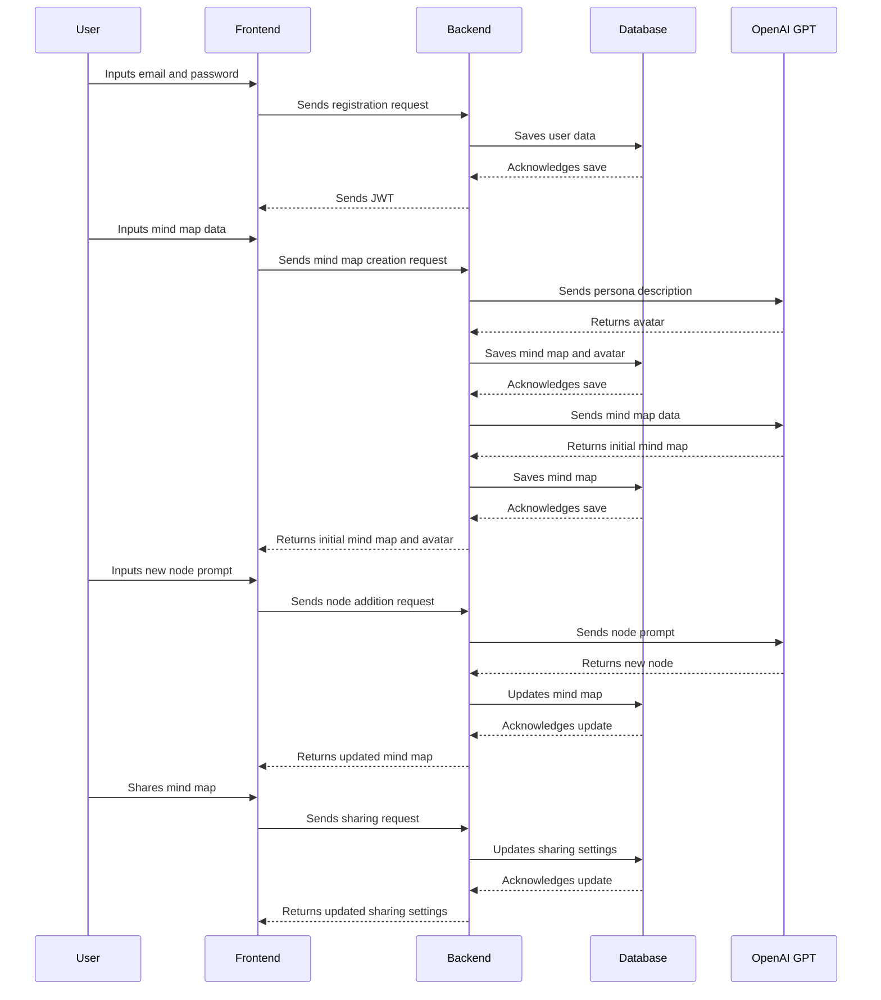

# mindfullai
mind map using ai

## Data Flow

1. **User Registration & Authentication:** The user enters their email and password. This data is sent to the Express.js backend, which validates the input, saves the user data to the MongoDB database, and returns a JWT for future authenticated requests.

2. **Mind Map Creation:** The user inputs the persona description, mind map description, and any notes. This data is sent to the backend, which stores it in MongoDB. In parallel, the persona description is used to generate an AI avatar.

3. **AI Mind Map Generation:** The backend uses the OpenAI GPT to process the user input and generate the initial mind map. The generated mind map data is then saved in the MongoDB database.

4. **Node Addition/Modification:** When the user wants to add or modify a node, the frontend sends a request to the backend with the required data (e.g., the prompt for new nodes, the node to be modified). The backend uses OpenAI GPT to process the request and return the generated/modified node.

5. **Sharing and Collaboration:** The sharing of a mind map sends a request to the backend to update the sharing settings in the MongoDB database. Shared users can send requests to modify the mind map, and these requests are processed similarly to the node addition/modification flow.

below is the data flow in a sequence diagram using the Mermaid syntax:

Please note that this diagram assumes successful operations for simplicity. In real-world scenarios, each interaction should also handle potential failures.
