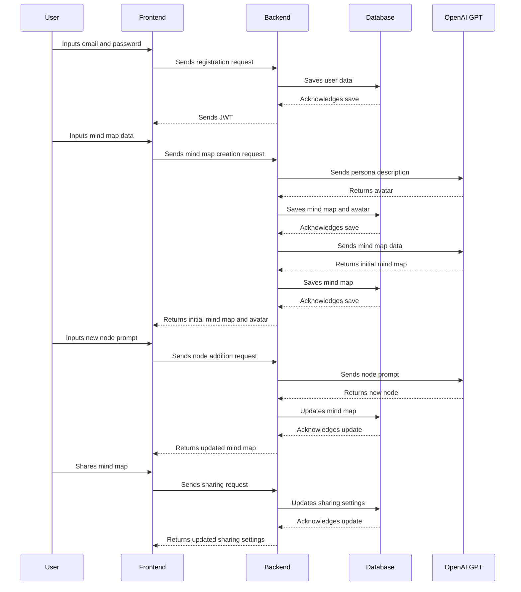

# mindfullai
mind map using ai

## High-Level Architectural Design

### Frontend - Next.js

The frontend application will be built using Next.js due to its hybrid static & server rendering and its capability to scale efficiently.

1. **User Registration & Authentication:** The frontend will handle the user registration using email and password, and we will use JWT (JSON Web Tokens) for user authentication.

2. **Mind Map Interface:** This will be the main screen where users can interact with their mind map. The interface will consist of multiple components like Node Component (for adding, displaying and connecting nodes), Sidebar Component (for switching between maps and other functionalities), Search Component (to search for public maps), etc.

3. **AI Avatar Generation:** For generating a cartoon-like image avatar based on the description, we could use an external API or library that has the capability to generate these avatars.

### Backend - Express.js

Express.js will handle all server-side logic including user registration, authentication, and database operations.

1. **User Registration & Authentication:** Similar to the frontend, we will implement a registration and login system using email and password. All the user data will be stored in the MongoDB database.

2. **Mind Map Operations:** The backend server will handle all CRUD operations related to mind maps. This includes creating a new mind map, updating nodes, saving the current state, retrieving existing mind maps, deleting mind maps, and handling map sharing.

### Database - MongoDB

MongoDB will store all application data including user credentials, user profile information, and mind map data.

1. **User Collection:** This will store all user-related information including the email, hashed password, API keys (if provided), and user's avatars.

2. **Mind Map Collection:** This collection will hold all the mind map data. Each document will represent a mind map, storing data such as the owner, sharing permissions, current state of the map, and all nodes information.

### OpenAI GPT Integration

The application will use the OpenAI GPT model for several AI functionalities.

1. **Node Generation:** Based on the user's inputs, the application will use GPT to generate new nodes or expand existing ones.

2. **AI Avatar Description:** When a new mind map is created, GPT can be used to provide a more detailed textual description of the avatar based on the user's persona input.

3. **Mind Map Description:** GPT can be used to generate a comprehensive mind map description based on user's input or context of the mind map.

4. **Markdown Formatting:** As GPT understands and can generate markdown, it can be used to create and format nodes' text in markdown.

### Integration with Other Applications

The application will provide an interface (possibly a REST API) for other applications to use and build upon the AI mind map. They can use it to create flow charts, marketing automation diagrams, or other related functionalities.

This design includes the main components of your application and can be refined or extended as necessary. Let me know if there are any changes or additional features you would like to discuss.

## Data Flow

1. **User Registration & Authentication:** The user enters their email and password. This data is sent to the Express.js backend, which validates the input, saves the user data to the MongoDB database, and returns a JWT for future authenticated requests.

2. **Mind Map Creation:** The user inputs the persona description, mind map description, and any notes. This data is sent to the backend, which stores it in MongoDB. In parallel, the persona description is used to generate an AI avatar.

3. **AI Mind Map Generation:** The backend uses the OpenAI GPT to process the user input and generate the initial mind map. The generated mind map data is then saved in the MongoDB database.

4. **Node Addition/Modification:** When the user wants to add or modify a node, the frontend sends a request to the backend with the required data (e.g., the prompt for new nodes, the node to be modified). The backend uses OpenAI GPT to process the request and return the generated/modified node.

5. **Sharing and Collaboration:** The sharing of a mind map sends a request to the backend to update the sharing settings in the MongoDB database. Shared users can send requests to modify the mind map, and these requests are processed similarly to the node addition/modification flow.

below is the data flow in a sequence diagram using the Mermaid syntax:

