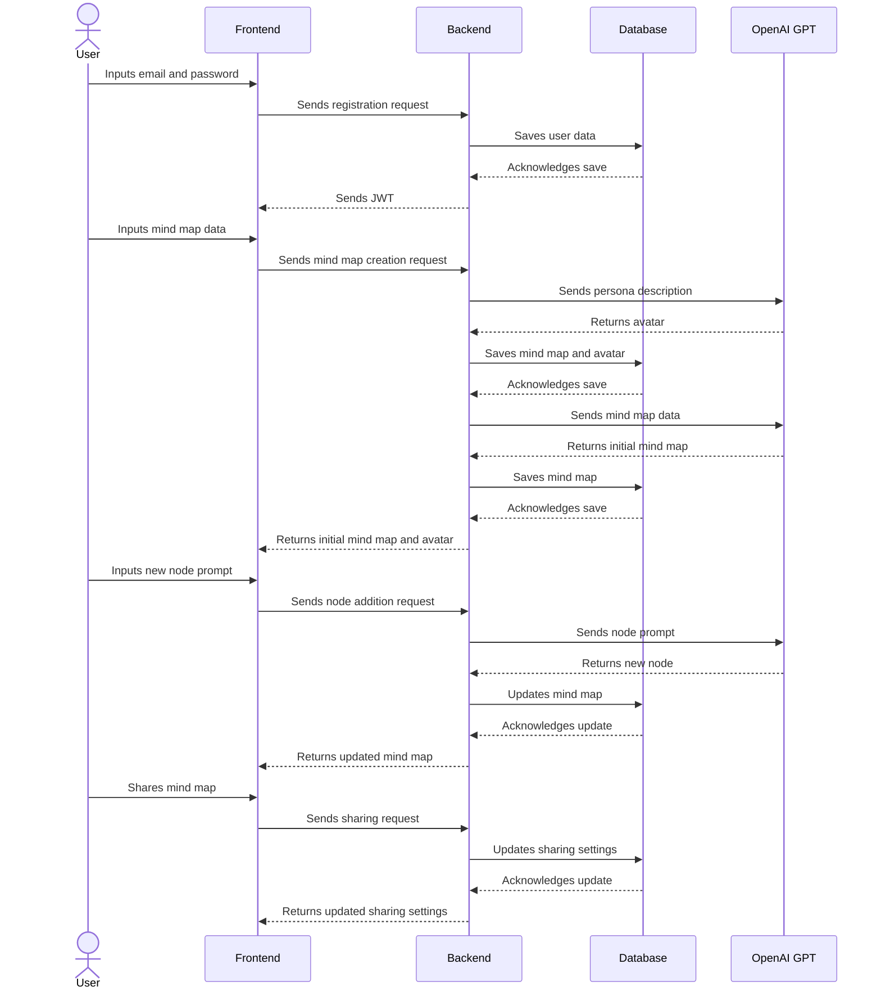
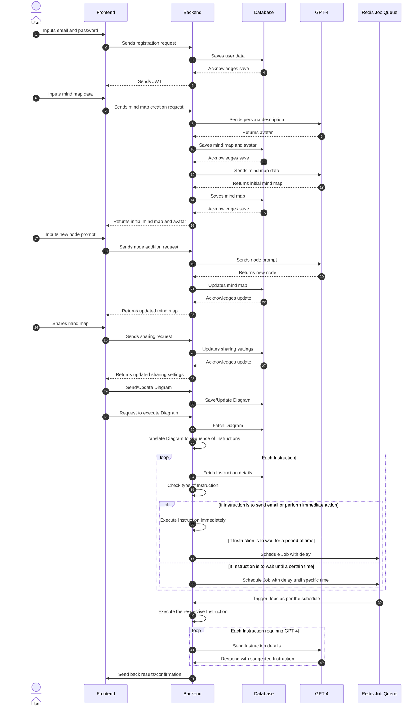
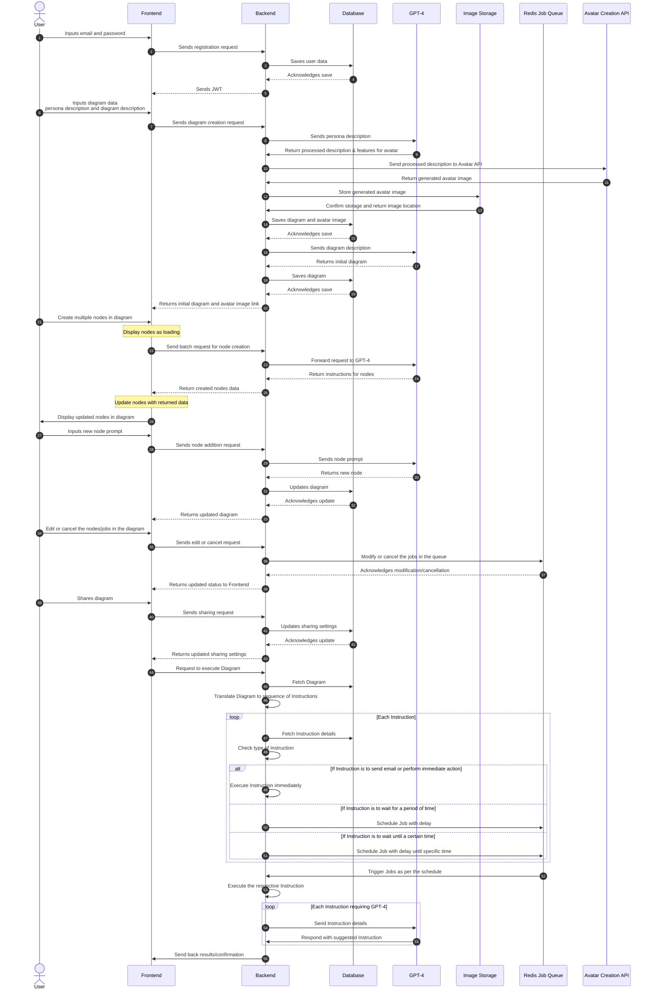
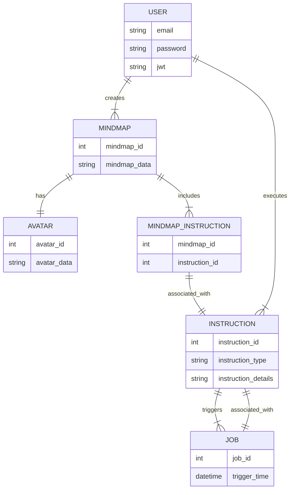

Table of content:

- [mindfullai](#mindfullai)
  - [App features](#app-features)
  - [High-Level Architectural Design](#high-level-architectural-design)
    - [Frontend - Next.js](#frontend---nextjs)
    - [Backend - Express.js](#backend---expressjs)
    - [Database - MongoDB](#database---mongodb)
    - [OpenAI GPT Integration](#openai-gpt-integration)
    - [Integration with Other Applications](#integration-with-other-applications)
  - [Data Flow](#data-flow)
- [Incorporation of Redis Job Queue and Enhanced Workflow Processing](#incorporation-of-redis-job-queue-and-enhanced-workflow-processing)
  - [Introduction of Redis Job Queue](#introduction-of-redis-job-queue)
  - [Enhanced Diagram Execution Workflow](#enhanced-diagram-execution-workflow)
  - [Summary](#summary)
    - [Incorporating optimized patch node creation](#incorporating-optimized-patch-node-creation)
    - [Entity-Relationship (ER) Diagram based on the Sequence Diagram](#entity-relationship-er-diagram-based-on-the-sequence-diagram)

# mindfullai

**AI Mind Map Web App** is an innovative tool designed to revolutionize the way individuals and teams brainstorm, conceptualize, and share ideas. Leveraging the power of OpenAI's GPT technology, this app is capable of taking user inputs and translating them into comprehensive, visually appealing, and dynamic mind maps. The app incorporates the concept of AI avatars, allowing users to create a persona that the mind map will revolve around, adding a new dimension to idea generation and project planning.

**Mission Statement:** 

"Our mission is to empower individuals and teams with an intelligent and intuitive tool to transform abstract thoughts into tangible and structured visualizations. We aim to push the boundaries of creative and strategic thinking by leveraging AI technology, ultimately driving innovation and fostering collaboration."

**Objective:** 

Our objective is to create an application that provides a seamless and enhanced mind-mapping experience. This includes:

1. Offering users an intuitive interface to create, edit, and manage mind maps.

2. Integrating AI technology to assist users in generating and expanding ideas, contributing to more comprehensive and valuable mind maps.

3. Enabling sharing and collaboration among users to facilitate collective brainstorming and project planning.

4. Providing a platform that respects user privacy and allows data portability, enabling users to use their mind maps across various platforms and applications. 

5. Continually improving and expanding our offerings based on user feedback and technological advancements, ensuring our app remains at the forefront of AI-assisted mind mapping tools.

**Target Audience:**

Our primary target audience includes project managers, creative professionals, strategists, educators, and students who frequently use brainstorming and mind mapping techniques for idea generation, project planning, and collaborative work.

**Key Value Proposition:**

Our app offers a unique blend of AI-powered mind mapping, allowing for deeper thought exploration and idea expansion, coupled with a highly intuitive interface designed for ease of use, collaboration, and the seamless sharing of maps.

**Unique Selling Proposition:**

Transform your thoughts into AI-powered dynamic mind maps for deeper exploration, seamless collaboration, and more efficient project planning.

**Key Feature to Focus on:**

The key attractive value that the app revolves around is the "AI-Assisted Mind Mapping". This unique integration of AI technology with traditional mind mapping not only simplifies the process of creating and expanding mind maps but also brings in a level of depth, context, and detail that isn't possible with traditional methods. This feature, combined with the intuitive interface and collaboration capabilities, is what sets this app apart from others in the market.


## App features

1. **User Registration & Authentication:**
   - **Email Registration:** Users can sign up using their email and a secure password.
   - **Authentication:** Users can log in securely to access their personalized mind map dashboard.

2. **AI-Assisted Mind Mapping:**
   - **Mind Map Creation:** Users can start a new mind map with AI assistance, providing a persona description and mind map details.
   - **AI Avatar Generation:** Based on the persona description, the application generates a cartoon-like avatar to represent the persona.
   - **Node Generation:** Users can add new nodes to the mind map, either manually or using AI to generate nodes based on a given prompt or context.
   - **Node Expansion:** Users can expand existing nodes, again manually or using AI, enhancing the details and context of the mind map.
   - **Markdown Support:** All node text supports markdown formatting for structured and detailed nodes.
   - **Cross Node Connection:** Users can create connections between distant nodes, creating complex and comprehensive mind maps.

3. **Collaboration and Sharing:**
   - **Mind Map Sharing:** Users can share their mind maps with others, either publicly (viewable and cloneable from a gallery) or privately (through invitation).
   - **Collaborative Editing:** Invited users can edit shared mind maps, allowing for collaborative brainstorming and planning.

4. **User-Friendly Interface:**
   - **Interactive Nodes:** Nodes can be interactively dragged and linked, with child nodes moving along with parent nodes.
   - **Node Buttons:** Hovering over a node reveals buttons for adding new nodes, generating text ideas, creating articles, and generating images.

5. **Data Portability and Integration:**
   - **Context Download:** Users can download the full context from the starting node to any given node, for use outside of the application.
   - **Flow Chart/Diagram Creation:** The stored mind map can be used as a starting point for creating other types of diagrams such as flow charts and marketing automation diagrams.
   - **OpenAI GPT Integration:** The application integrates with OpenAI GPT, either using the user's API key or the app's API key, to provide AI functionalities.
   - **Database Storage:** All mind maps are securely stored and retrieved from a MongoDB database, ensuring data durability and availability.


## High-Level Architectural Design

### Frontend - Next.js

The frontend application will be built using Next.js due to its hybrid static & server rendering and its capability to scale efficiently.

1. **User Registration & Authentication:** The frontend will handle the user registration using email and password, and we will use JWT (JSON Web Tokens) for user authentication.

2. **Mind Map Interface:** This will be the main screen where users can interact with their mind map. The interface will consist of multiple components like Node Component (for adding, displaying and connecting nodes), Sidebar Component (for switching between maps and other functionalities), Search Component (to search for public maps), etc.

3. **AI Avatar Generation:** For generating a cartoon-like image avatar based on the description, we could use an external API or library that has the capability to generate these avatars.

### Backend - Express.js

Express.js will handle all server-side logic including user registration, authentication, and database operations.

1. **User Registration & Authentication:** Similar to the frontend, we will implement a registration and login system using email and password. All the user data will be stored in the MongoDB database.

2. **Mind Map Operations:** The backend server will handle all CRUD operations related to mind maps. This includes creating a new mind map, updating nodes, saving the current state, retrieving existing mind maps, deleting mind maps, and handling map sharing.

### Database - MongoDB

MongoDB will store all application data including user credentials, user profile information, and mind map data.

1. **User Collection:** This will store all user-related information including the email, hashed password, API keys (if provided), and user's avatars.

2. **Mind Map Collection:** This collection will hold all the mind map data. Each document will represent a mind map, storing data such as the owner, sharing permissions, current state of the map, and all nodes information.

### OpenAI GPT Integration

The application will use the OpenAI GPT model for several AI functionalities.

1. **Node Generation:** Based on the user's inputs, the application will use GPT to generate new nodes or expand existing ones.

2. **AI Avatar Description:** When a new mind map is created, GPT can be used to provide a more detailed textual description of the avatar based on the user's persona input.

3. **Mind Map Description:** GPT can be used to generate a comprehensive mind map description based on user's input or context of the mind map.

4. **Markdown Formatting:** As GPT understands and can generate markdown, it can be used to create and format nodes' text in markdown.

### Integration with Other Applications

The application will provide an interface (possibly a REST API) for other applications to use and build upon the AI mind map. They can use it to create flow charts, marketing automation diagrams, or other related functionalities.

This design includes the main components of your application and can be refined or extended as necessary. Let me know if there are any changes or additional features you would like to discuss.

## Data Flow

1. **User Registration & Authentication:** The user enters their email and password. This data is sent to the Express.js backend, which validates the input, saves the user data to the MongoDB database, and returns a JWT for future authenticated requests.

2. **Mind Map Creation:** The user inputs the persona description, mind map description, and any notes. This data is sent to the backend, which stores it in MongoDB. In parallel, the persona description is used to generate an AI avatar.

3. **AI Mind Map Generation:** The backend uses the OpenAI GPT to process the user input and generate the initial mind map. The generated mind map data is then saved in the MongoDB database.

4. **Node Addition/Modification:** When the user wants to add or modify a node, the frontend sends a request to the backend with the required data (e.g., the prompt for new nodes, the node to be modified). The backend uses OpenAI GPT to process the request and return the generated/modified node.

5. **Sharing and Collaboration:** The sharing of a mind map sends a request to the backend to update the sharing settings in the MongoDB database. Shared users can send requests to modify the mind map, and these requests are processed similarly to the node addition/modification flow.

below is the data flow in a sequence diagram using the Mermaid syntax:



# Incorporation of Redis Job Queue and Enhanced Workflow Processing

In this updated sequence chart, we have introduced new elements and workflows to accommodate more complex interactions. The major changes are as follows:

## [Introduction of Redis Job Queue](./tutorial/)

A new participant, the **Redis Job Queue** (R), has been added to our sequence. Redis is an open-source, in-memory data structure store used as a database, cache, and message broker. In our scenario, it's used as a Job Queue for managing asynchronous tasks.

Jobs that need to be executed at a later time (either after a delay or at a specific time) are now scheduled in the Redis Job Queue. This allows for better management of tasks that don't need to be performed immediately and improves the responsiveness of our application.

## [Enhanced Diagram Execution Workflow](./tutorial/diagram-execution-workflow.md)

In the updated sequence, there is a new process related to diagram execution. The user can now send or update a diagram via the frontend, which then gets saved or updated in the database by the backend. The user can also request the backend to execute a specific diagram. 

The backend fetches the requested diagram from the database and translates it into a sequence of instructions. Each instruction is fetched in detail from the database, and based on the type of instruction, various actions can occur:

- If the instruction is to send an email or perform an immediate action, the backend executes the instruction right away.
- If the instruction is to wait for a certain period or until a specific time, the backend schedules the job with the required delay in the Redis Job Queue.

The Redis Job Queue triggers the jobs as per the schedule, and the backend executes the corresponding instruction.

Moreover, if an instruction requires the use of the GPT-4 AI model, the backend sends the instruction details to GPT-4, which then returns the suggested instruction. This process occurs in a loop for each instruction requiring GPT-4.

Once all instructions have been processed, the backend returns the results or confirmation to the frontend.

## Summary

The updated sequence chart represents a more complex application workflow with the integration of the Redis Job Queue for managing asynchronous tasks and an enhanced diagram execution workflow that incorporates immediate execution, delayed jobs, and interaction with the GPT-4 AI model for certain instructions.



### Incorporating optimized patch node creation



### [Entity-Relationship (ER) Diagram based on the Sequence Diagram](./tutorial/index/sql.md)

**Introduction**

Creating an Entity-Relationship (ER) diagram based on a sequence diagram involves determining the entities (or 'tables') involved and their relationships, including attributes and primary/foreign keys. In the case of your sequence diagram, the main entities we can discern are `User`, `MindMap`, `Instruction`, `Avatar`, and `Job`.

**Mermaid ER Diagram**



```dbdiagram
Table User {
  email varchar [pk]
  password varchar
  jwt varchar
}

Table MindMap {
  mindmap_id int [pk]
  mindmap_data varchar
  user_email varchar
}

Table Avatar {
  avatar_id int [pk]
  avatar_data varchar
  mindmap_id int
}

Table Instruction {
  instruction_id int [pk]
  instruction_type varchar
  instruction_details varchar
}

Table Job {
  job_id int [pk]
  trigger_time timestamp
  instruction_id int
}

Table MindMap_Instruction {
  mindmap_id int
  instruction_id int
}

Ref: MindMap.user_email > User.email // one-to-many

Ref: Avatar.mindmap_id > MindMap.mindmap_id // one-to-one

Ref: Instruction.instruction_id < Job.instruction_id // one-to-many

Ref: MindMap.mindmap_id < MindMap_Instruction.mindmap_id // one-to-many

Ref: Instruction.instruction_id < MindMap_Instruction.instruction_id // one-to-many

```

**Entities (Tables) Description**

1. `User`: This entity represents the users of the system. The attributes include `email`, `password`, and `jwt` (JSON Web Token for authentication).
2. `MindMap`: This entity represents the mind maps created by the users. It has an ID (`mindmap_id`) and the mind map data (`mindmap_data`).
3. `Avatar`: This entity represents the avatars created by the GPT-4 AI. Each mind map has an associated avatar.
4. `Instruction`: This entity stores the instructions associated with each mind map. The attributes include `instruction_id`, `instruction_type`, and `instruction_details`.
5. `Job`: This entity represents the jobs created for delayed or scheduled instructions. It has a `job_id` and a `trigger_time` which indicates when the job should be executed.
6. `MindMap_Instruction`: This is the junction table that represents the many-to-many relationship between the `MindMap` and `Instruction` tables. It contains `mindmap_id` and `instruction_id` as foreign keys.
   
------

1. **API Specs:** Use OpenAPI format. Endpoint `/api/register` (POST) - Expects: `{email, password}`, Returns: `{jwt}`. Endpoint `/api/diagram` (POST) - Expects: `{jwt, diagramData}`, Returns: `{status, diagramData}`.

2. **Auth:** JWT based authentication. User roles: 'admin', 'user'. 'Admin' has all permissions, 'user' can create/edit own diagrams, view shared diagrams.

3. **Error Handling:** Application employs try-catch logic. On failure, errors are logged server-side and a generic error message is returned to the client.

4. **Business Rules:** Nodes creation limited to 100 per user. Instructions priority determined by user at creation, can be adjusted later. Nodes are only editable by the creator user.

5. **Tech Stack:** Frontend - React, Backend - Node.js with Express, Database - PostgreSQL, Avatar API - Python Flask, Job Queue - Redis, Storage - AWS S3.

6. **Test Cases:** Unit tests for each API endpoint. Integration test for user registration-login-diagram creation flow. End-to-end tests for user journeys.
