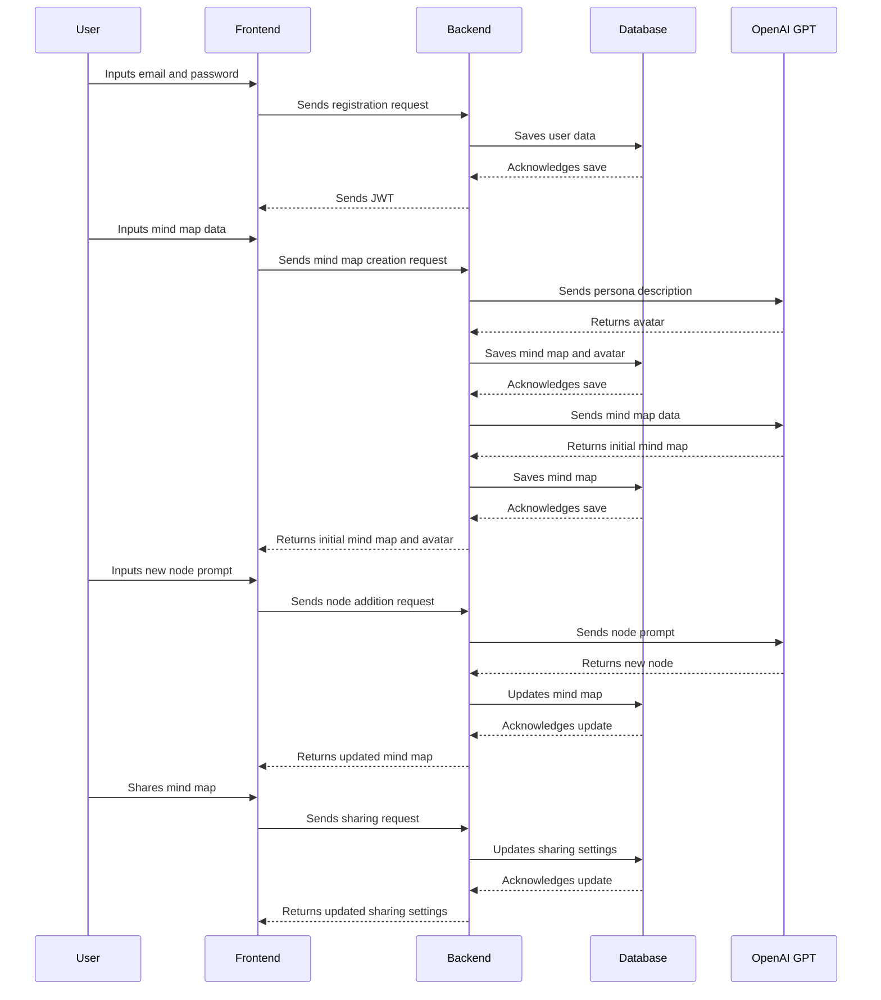

# mindfullai
mind map using ai

```mermaid
sequenceDiagram
    participant U as User
    participant F as Frontend
    participant B as Backend
    participant D as Database
    participant AI as OpenAI GPT
    U->>F: Inputs email and password
    F->>B: Sends registration request
    B->>D: Saves user data
    D-->>B: Acknowledges save
    B-->>F: Sends JWT
    U->>F: Inputs mind map data
    F->>B: Sends mind map creation request
    B->>AI: Sends persona description
    AI-->>B: Returns avatar
    B->>D: Saves mind map and avatar
    D-->>B: Acknowledges save
    B->>AI: Sends mind map data
    AI-->>B: Returns initial mind map
    B->>D: Saves mind map
    D-->>B: Acknowledges save
    B-->>F: Returns initial mind map and avatar
    U->>F: Inputs new node prompt
    F->>B: Sends node addition request
    B->>AI: Sends node prompt
    AI-->>B: Returns new node
    B->>D: Updates mind map
    D-->>B: Acknowledges update
    B-->>F: Returns updated mind map
    U->>F: Shares mind map
    F->>B: Sends sharing request
    B->>D: Updates sharing settings
    D-->>B: Acknowledges update
    B-->>F: Returns updated sharing settings
```
