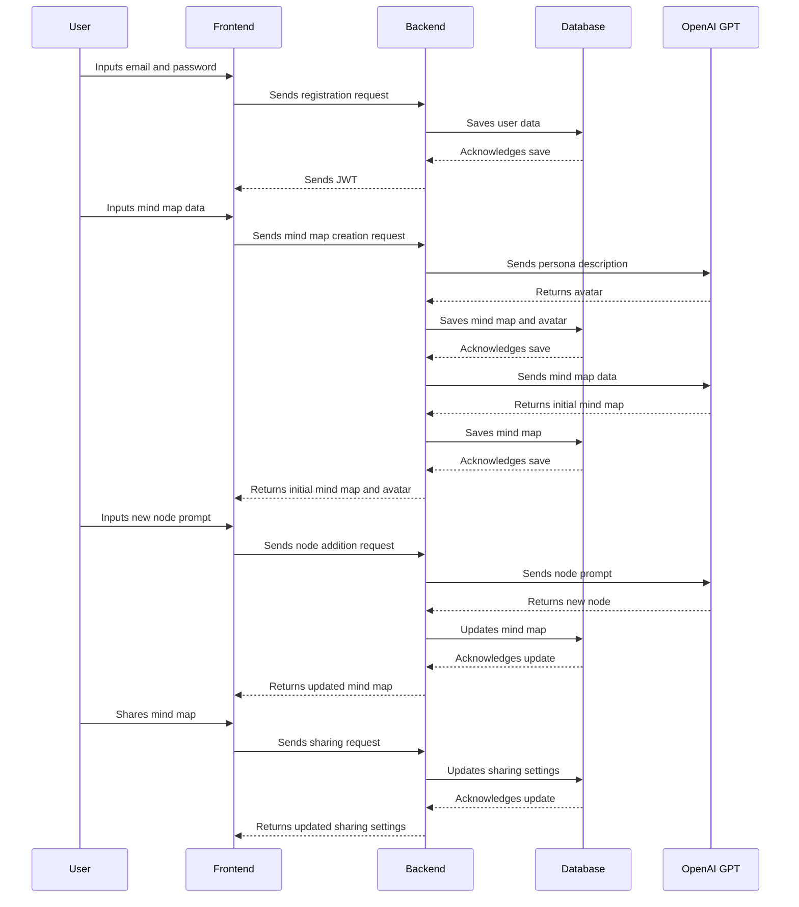

# mindfullai

**AI Mind Map Web App** is an innovative tool designed to revolutionize the way individuals and teams brainstorm, conceptualize, and share ideas. Leveraging the power of OpenAI's GPT technology, this app is capable of taking user inputs and translating them into comprehensive, visually appealing, and dynamic mind maps. The app incorporates the concept of AI avatars, allowing users to create a persona that the mind map will revolve around, adding a new dimension to idea generation and project planning.

**Mission Statement:** 

"Our mission is to empower individuals and teams with an intelligent and intuitive tool to transform abstract thoughts into tangible and structured visualizations. We aim to push the boundaries of creative and strategic thinking by leveraging AI technology, ultimately driving innovation and fostering collaboration."

**Objective:** 

Our objective is to create an application that provides a seamless and enhanced mind-mapping experience. This includes:

1. Offering users an intuitive interface to create, edit, and manage mind maps.

2. Integrating AI technology to assist users in generating and expanding ideas, contributing to more comprehensive and valuable mind maps.

3. Enabling sharing and collaboration among users to facilitate collective brainstorming and project planning.

4. Providing a platform that respects user privacy and allows data portability, enabling users to use their mind maps across various platforms and applications. 

5. Continually improving and expanding our offerings based on user feedback and technological advancements, ensuring our app remains at the forefront of AI-assisted mind mapping tools.

**Target Audience:**

Our primary target audience includes project managers, creative professionals, strategists, educators, and students who frequently use brainstorming and mind mapping techniques for idea generation, project planning, and collaborative work.

**Key Value Proposition:**

Our app offers a unique blend of AI-powered mind mapping, allowing for deeper thought exploration and idea expansion, coupled with a highly intuitive interface designed for ease of use, collaboration, and the seamless sharing of maps.

**Unique Selling Proposition:**

Transform your thoughts into AI-powered dynamic mind maps for deeper exploration, seamless collaboration, and more efficient project planning.

**Key Feature to Focus on:**

The key attractive value that the app revolves around is the "AI-Assisted Mind Mapping". This unique integration of AI technology with traditional mind mapping not only simplifies the process of creating and expanding mind maps but also brings in a level of depth, context, and detail that isn't possible with traditional methods. This feature, combined with the intuitive interface and collaboration capabilities, is what sets this app apart from others in the market.

## App features

1. **User Registration & Authentication:**
   - **Email Registration:** Users can sign up using their email and a secure password.
   - **Authentication:** Users can log in securely to access their personalized mind map dashboard.

2. **AI-Assisted Mind Mapping:**
   - **Mind Map Creation:** Users can start a new mind map with AI assistance, providing a persona description and mind map details.
   - **AI Avatar Generation:** Based on the persona description, the application generates a cartoon-like avatar to represent the persona.
   - **Node Generation:** Users can add new nodes to the mind map, either manually or using AI to generate nodes based on a given prompt or context.
   - **Node Expansion:** Users can expand existing nodes, again manually or using AI, enhancing the details and context of the mind map.
   - **Markdown Support:** All node text supports markdown formatting for structured and detailed nodes.
   - **Cross Node Connection:** Users can create connections between distant nodes, creating complex and comprehensive mind maps.

3. **Collaboration and Sharing:**
   - **Mind Map Sharing:** Users can share their mind maps with others, either publicly (viewable and cloneable from a gallery) or privately (through invitation).
   - **Collaborative Editing:** Invited users can edit shared mind maps, allowing for collaborative brainstorming and planning.

4. **User-Friendly Interface:**
   - **Interactive Nodes:** Nodes can be interactively dragged and linked, with child nodes moving along with parent nodes.
   - **Node Buttons:** Hovering over a node reveals buttons for adding new nodes, generating text ideas, creating articles, and generating images.

5. **Data Portability and Integration:**
   - **Context Download:** Users can download the full context from the starting node to any given node, for use outside of the application.
   - **Flow Chart/Diagram Creation:** The stored mind map can be used as a starting point for creating other types of diagrams such as flow charts and marketing automation diagrams.
   - **OpenAI GPT Integration:** The application integrates with OpenAI GPT, either using the user's API key or the app's API key, to provide AI functionalities.
   - **Database Storage:** All mind maps are securely stored and retrieved from a MongoDB database, ensuring data durability and availability.

## High-Level Architectural Design

### Frontend - Next.js

The frontend application will be built using Next.js due to its hybrid static & server rendering and its capability to scale efficiently.

1. **User Registration & Authentication:** The frontend will handle the user registration using email and password, and we will use JWT (JSON Web Tokens) for user authentication.

2. **Mind Map Interface:** This will be the main screen where users can interact with their mind map. The interface will consist of multiple components like Node Component (for adding, displaying and connecting nodes), Sidebar Component (for switching between maps and other functionalities), Search Component (to search for public maps), etc.

3. **AI Avatar Generation:** For generating a cartoon-like image avatar based on the description, we could use an external API or library that has the capability to generate these avatars.

### Backend - Express.js

Express.js will handle all server-side logic including user registration, authentication, and database operations.

1. **User Registration & Authentication:** Similar to the frontend, we will implement a registration and login system using email and password. All the user data will be stored in the MongoDB database.

2. **Mind Map Operations:** The backend server will handle all CRUD operations related to mind maps. This includes creating a new mind map, updating nodes, saving the current state, retrieving existing mind maps, deleting mind maps, and handling map sharing.

### Database - MongoDB

MongoDB will store all application data including user credentials, user profile information, and mind map data.

1. **User Collection:** This will store all user-related information including the email, hashed password, API keys (if provided), and user's avatars.

2. **Mind Map Collection:** This collection will hold all the mind map data. Each document will represent a mind map, storing data such as the owner, sharing permissions, current state of the map, and all nodes information.

### OpenAI GPT Integration

The application will use the OpenAI GPT model for several AI functionalities.

1. **Node Generation:** Based on the user's inputs, the application will use GPT to generate new nodes or expand existing ones.

2. **AI Avatar Description:** When a new mind map is created, GPT can be used to provide a more detailed textual description of the avatar based on the user's persona input.

3. **Mind Map Description:** GPT can be used to generate a comprehensive mind map description based on user's input or context of the mind map.

4. **Markdown Formatting:** As GPT understands and can generate markdown, it can be used to create and format nodes' text in markdown.

### Integration with Other Applications

The application will provide an interface (possibly a REST API) for other applications to use and build upon the AI mind map. They can use it to create flow charts, marketing automation diagrams, or other related functionalities.

This design includes the main components of your application and can be refined or extended as necessary. Let me know if there are any changes or additional features you would like to discuss.

## Data Flow

1. **User Registration & Authentication:** The user enters their email and password. This data is sent to the Express.js backend, which validates the input, saves the user data to the MongoDB database, and returns a JWT for future authenticated requests.

2. **Mind Map Creation:** The user inputs the persona description, mind map description, and any notes. This data is sent to the backend, which stores it in MongoDB. In parallel, the persona description is used to generate an AI avatar.

3. **AI Mind Map Generation:** The backend uses the OpenAI GPT to process the user input and generate the initial mind map. The generated mind map data is then saved in the MongoDB database.

4. **Node Addition/Modification:** When the user wants to add or modify a node, the frontend sends a request to the backend with the required data (e.g., the prompt for new nodes, the node to be modified). The backend uses OpenAI GPT to process the request and return the generated/modified node.

5. **Sharing and Collaboration:** The sharing of a mind map sends a request to the backend to update the sharing settings in the MongoDB database. Shared users can send requests to modify the mind map, and these requests are processed similarly to the node addition/modification flow.

below is the data flow in a sequence diagram using the Mermaid syntax:

## folder structure

{
  "meta": {
    "name": "AI Mind Map Web App",
    "seo": {
      "keywords": ["AI", "Mind Map", "Collaboration", "Web App"],
      "title": "AI Mind Map Web App: Revolutionize Your Brainstorming Process",
      "article": "In the contemporary professional landscape, brainstorming and ideation processes are often fraught with challenges...this is where the AI Mind Map Web App comes into play. This unique solution harnesses the power of AI to revolutionize your brainstorming process, offering a host of benefits such as streamlined collaboration, intuitive user interface, and AI-driven insights. Don't wait, unlock your team's creative potential today with the AI Mind Map Web App.",
      "tags": "AI, Mind Map, Web App, Brainstorming, Collaboration"
    },
    "description": "A Web Application that leverages AI to create interactive and dynamic mind maps, fostering enhanced collaboration and idea generation.",
    "dependencies": ["Next.js", "React", "Express", "MongoDB", "Node.js"],
    "summary": "AI-powered web application for creating and collaborating on mind maps.",
    "tags": "AI, Mind Map, Web App, Collaboration"
  },
  "messages": [
    {
      "role": "system",
      "content": "Skills required: Full Stack Development (Node.js, Express.js), Frontend (React, Next.js), Database (MongoDB), AI (OpenAI GPT-3/4)"
    },
    {
      "role": "system",
      "content": "Project 'AI Mind Map Web App' is a web-based application that allows users to create, share and collaborate on dynamic mind maps leveraging AI technology."
    },
    {
      "role": "system",
      "content": "Run 'npm install next react react-dom express mongoose' to install the dependencies."
    },
    {
      "role": "system",
      "content": "Implementation steps include: 1. Setting up the development environment, 2. Creating the database schema, 3. Building the backend and API endpoints, 4. Developing the frontend and integrating with the backend, 5. Testing and deployment."
    },
    {
      "role": "system",
      "content": "AI-Mind-Map-Web-App/{frontend/{public/{index.html, favicon.ico, manifest.json}, src/{assets/{images/{logo.svg}, styles/{app.scss, _variables.scss}}, ...}"
    },
    {
      "role": "system",
      "content": "Features include: AI-powered mind map creation, User registration and authentication, Collaboration features, Avatar generation, Mind map sharing, Cross-node connections, and more."
    }
  ],
  "folderStructure": {
    "AI-Mind-Map-Web-App": {
      "frontend": {
        "public": {
          "index.html": {
            "instructions": "This is the main HTML document that is served when visitors access your site. The rest of the application's content will be injected into this file during rendering by React.",
            "implemented": false
          },
          "favicon.ico": {
            "instructions": "This is the small icon that is displayed in the browser tab next to the page title.",
            "implemented": false
          },
          "manifest.json": {
            "instructions": "This is the Web App Manifest, a JSON file that tells the browser about your Progressive Web App and how it should behave when installed on the user's desktop or mobile device.",
            "implemented": false
          },
          ...
        }
      },
      ...
    }
  }
}
``

