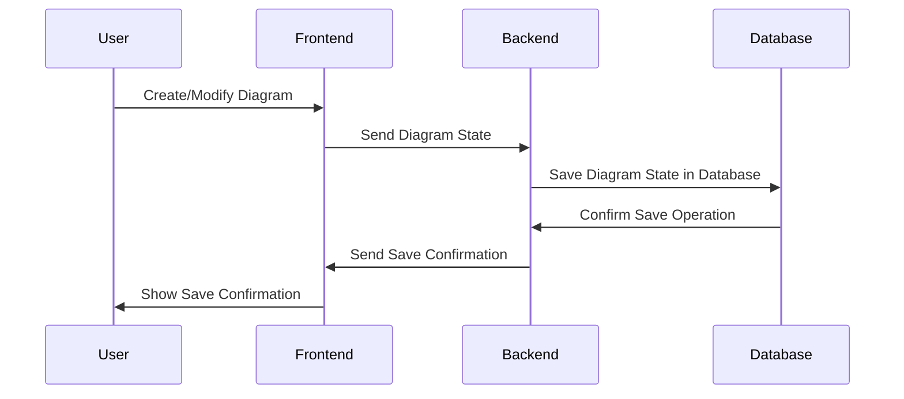
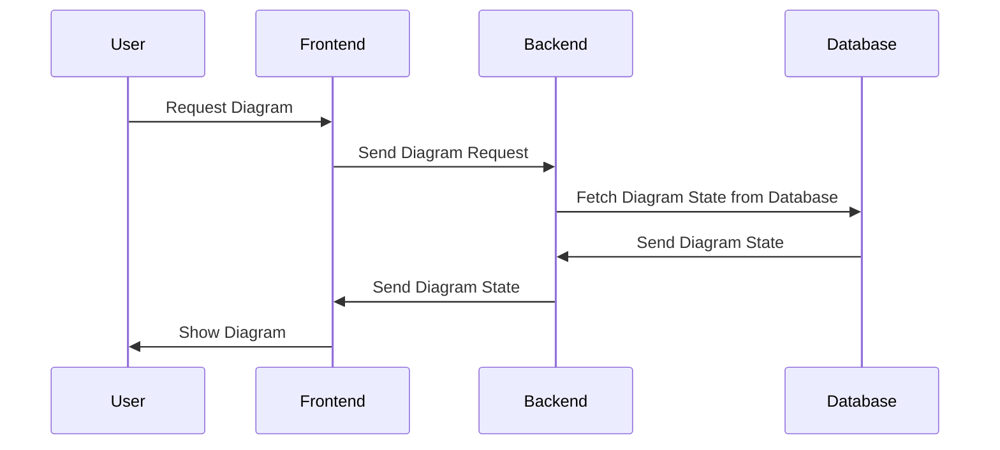

# 1. Persist the React Flow Diagram

Persisting the React Flow Diagram involves saving the state of the entire diagram in your database. The state, in this case, refers to the entire configuration of the diagram, including the positions and connections of the nodes.

For instance, you could have a Diagram table with columns to store details about the diagram like so:

```
Diagram Table`
---------------
ID  | Diagram_State
1   | {'nodes': [{...}], 'edges': [{...}]}
```


Where `Diagram_State` is a JSON object containing the serialized state of the React Flow diagram.

Now, when a user creates or modifies a diagram, we need to save this state to the database. This is a mermaid sequence diagram outlining that process:



This diagram depicts a user creating or modifying a diagram on the frontend, which sends the serialized diagram state to the backend. The backend then persists this state in the database and sends a confirmation back to the frontend, which then informs the user that the operation was successful.

And later, when we need to retrieve the diagram, we can do it like this:



In this case, the user requests to view a diagram. The frontend sends this request to the backend, which fetches the corresponding diagram state from the database and returns it to the frontend. The frontend then deserializes the diagram state and displays the diagram to the user.
