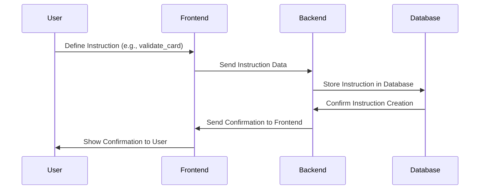

# 2. Model the instructions in your database

Let's dive deeper into how you would model the instructions in your database. As stated before, each instruction represents an action that your backend needs to perform. It's a step in your flow diagram, a node in your graph.

Let's take an example of an ecommerce website. When a user places an order, you might have a flow that goes something like this:

1. Validate user's credit card.
2. Charge the credit card.
3. Send a confirmation email.
4. Update the inventory.

These actions are your instructions that your backend needs to execute. Let's see how we might represent this in a database. 

For the purposes of this example, let's assume we're using a relational database like MySQL or PostgreSQL, and let's represent our instructions as a table:
link-diagrams-and-instructions

```
`Instructions Table`
--------------------
ID | Diagram_ID | InstructionType | Params                                     | Order
1  | 1          | validate_card   | {"card_number": "1234", "expiry": "12/23"} | 1
2  | 1          | charge_card     | {"amount": "100.00"}                       | 2
3  | 1          | send_email      | {"email": "example@example.com"}           | 3
4  | 1          | update_inventory| {"product_id": "5678", "quantity": "-1"}   | 4
```

Here:

- `ID` is a unique identifier for the instruction.
- `Diagram_ID` is a foreign key that relates the instruction to a particular flow diagram.
- `InstructionType` denotes the type of action to be performed.
- `Params` contains any additional data required to perform the action. It's stored as a JSON object for flexibility, but you might choose to normalize this data depending on your use case.
- `Order` indicates the sequence in which the instructions should be executed.

Here is the mermaid sequence diagram for creating these instructions:



This process is repeated for each instruction. The user (or system administrator) defines the instructions and their order in the frontend, which sends this data to the backend. The backend then stores these instructions in the database. After each instruction is stored, the backend sends a confirmation to the frontend, which in turn shows it to the user.

Finally, when you want to execute the flow, the backend fetches the instructions associated with the particular flow diagram, sorted by the `Order` field, and executes them sequentially. The frontend can then show the progress of each instruction to the user.