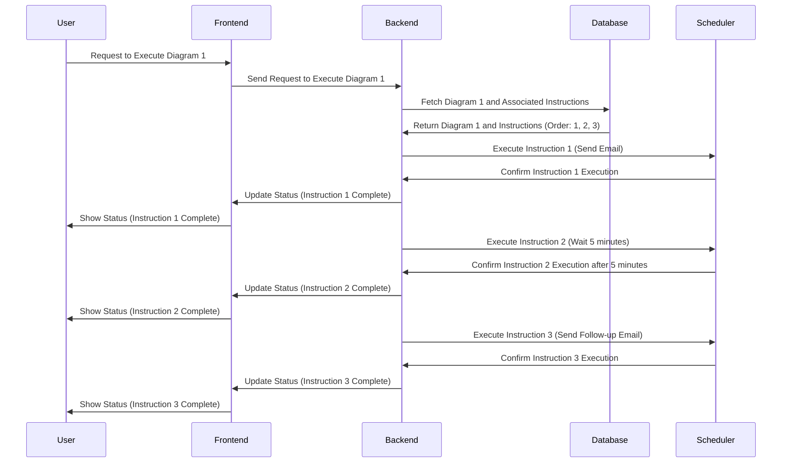

# 4. Process the diagram

Sure, let's break it down a little further.

Let's consider a simple case where you have a diagram with three nodes, each representing an instruction:

- Node 1: "Send an Email"
- Node 2: "Wait 5 minutes"
- Node 3: "Send a Follow-up Email"

This is how it might look in your `Diagram` and `Instruction` tables:

```
Diagram Table
-------------
ID    | DiagramName   
1     | 'Follow-up Email Process'  

Instruction Table
-----------------
ID    | InstructionType | Params
1     | 'send_email'    | {'to': 'example@example.com', 'from': 'noreply@myservice.com', 'subject': 'Hello', 'body': 'Hello, World'}
2     | 'wait'          | {'duration': '5m'}
3     | 'send_email'    | {'to': 'example@example.com', 'from': 'noreply@myservice.com', 'subject': 'Follow Up', 'body': 'This is a follow up email'}

Diagram_Instruction Table
-------------------------
Diagram_ID | Instruction_ID | Order
1          | 1              | 1
1          | 2              | 2
1          | 3              | 3
```

Now let's walk through the sequence of processing this diagram:



This sequence illustrates how the backend will process each instruction in the order defined by the Diagram_Instruction table. It executes the instructions one by one, providing updates to the frontend at each step, which then displays the status updates to the user. 

In a real-world situation, the Scheduler would likely be some sort of background process or worker that can handle executing the instructions asynchronously, especially for time-consuming tasks or those that need to be delayed (like the "Wait 5 minutes" instruction in this example).