# Diagram Execution Workflow

**Table of Content:**
- [Diagram Execution Workflow](#diagram-execution-workflow)
  - [Backend logic:](#backend-logic)
  - [How to control back end logic](#how-to-control-back-end-logic)
  - [how to create a chain of instructions (logic) via react flow diagram. and excuse it via back end.](#how-to-create-a-chain-of-instructions-logic-via-react-flow-diagram-and-excuse-it-via-back-end)
  - [Using a db layer](#using-a-db-layer)
  - [Encapsulates the Full App logic](#encapsulates-the-full-app-logic)
  - [Examples](#examples)
    - [Example 01 (Send Email)](#example-01-send-email)
    - [Example 2 ( a user who wants to create a diagram that consists of two instructions: Send an email, and then send a notification.)](#example-2--a-user-who-wants-to-create-a-diagram-that-consists-of-two-instructions-send-an-email-and-then-send-a-notification)
    - [ Example 3 (Email marketing service)](#example-3-email-marketing-service)
      - [Requirements](#requirements)
      - [Handling Exceptions:](#handling-exceptions)
      - [Status Reporting:](#status-reporting)
      - [Retry Mechanism:](#retry-mechanism)
      - [Task Priorities:](#task-priorities)
      - [Task Scheduling:](#task-scheduling)
      - [Synchronization](#synchronization)
        - [Example](#example)
        - [implementation example](#implementation-example)
          - [Merging Diagram \& Diagram\_Instructions tables](#merging-diagram--diagram_instructions-tables)


## Backend logic:

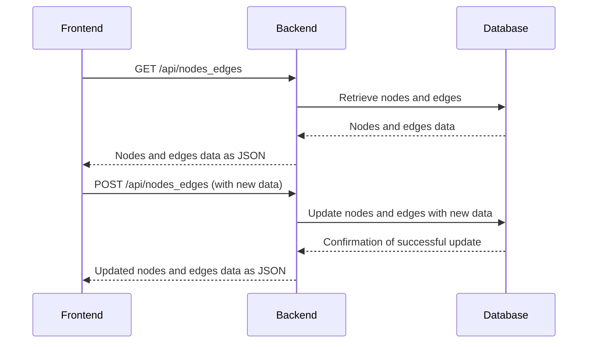
```mermaid
sequenceDiagram
    participant Frontend
    participant Backend
    participant Database

    Frontend->>Backend: GET /api/nodes_edges
    Backend->>Database: Retrieve nodes and edges
    Database-->>Backend: Nodes and edges data
    Backend-->>Frontend: Nodes and edges data as JSON

    Frontend->>Backend: POST /api/nodes_edges (with new data)
    Backend->>Database: Update nodes and edges with new data
    Database-->>Backend: Confirmation of successful update
    Backend-->>Frontend: Updated nodes and edges data as JSON
```

This diagram represents the interactions between the frontend, backend, and database during fetching and updating the nodes and edges for the react-flow library. It is a simplified representation and actual implementations may include more steps, like authentication and error handling.

## How to control back end logic

For example send email node, then send email after 5 minutes node

In order to control back-end logic using React-Flow or any other flow-based visual programming tool, you would first need to map each node and each edge in your diagram to specific functions or operations in your back-end code. 

In the case of an email operation, you might have a "Send Email" node that triggers a function in your back-end to send an email to a user, and a "Delay" node that uses something like JavaScript's `setTimeout` function to delay the next action by a specified amount of time. Then, if you connect these nodes in your flow diagram with an edge, the back-end would execute these operations in the order specified by the diagram.

This is a high-level example of how this might look in practice:

1. **"Send Email" Node**: When this node is activated (i.e., when an edge that points to this node is traversed), it triggers a function in your back-end that sends an email. This function might take parameters such as the recipient's email address, the subject line, and the body text.

2. **"Delay" Node**: When this node is activated, it triggers a function that delays the execution of the next action. This function would likely take a parameter specifying the amount of delay (e.g., 5 minutes).

3. **"Send Follow-Up Email" Node**: This node, which is connected to the "Delay" node by an edge, triggers a function that sends a follow-up email after the delay.

This is a hypothetical sequence diagram illustrating this flow:

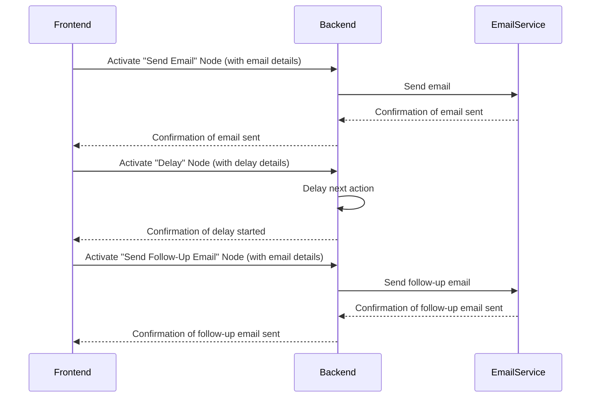
```mermaid
sequenceDiagram
    participant Frontend
    participant Backend
    participant EmailService

    Frontend->>Backend: Activate "Send Email" Node (with email details)
    Backend->>EmailService: Send email
    EmailService-->>Backend: Confirmation of email sent
    Backend-->>Frontend: Confirmation of email sent

    Frontend->>Backend: Activate "Delay" Node (with delay details)
    Backend->>Backend: Delay next action
    Backend-->>Frontend: Confirmation of delay started

    Frontend->>Backend: Activate "Send Follow-Up Email" Node (with email details)
    Backend->>EmailService: Send follow-up email
    EmailService-->>Backend: Confirmation of follow-up email sent
    Backend-->>Frontend: Confirmation of follow-up email sent
```

The actual implementation details of this flow would depend on the specific back-end framework and email service you're using.

## how to create a chain of instructions (logic) via react flow diagram. and excuse it via back end.

To create a chain of instructions and execute it via backend using a React Flow diagram, you'd need to ensure that each node in your React Flow diagram corresponds to an instruction, function, or operation in your backend logic.

The process generally involves the following steps:

1. **Design the Flow Diagram:** Create a React Flow diagram where each node represents an operation or function call in your backend. The edges represent the sequence of these operations. It could be something as simple as a linear flow where one operation follows another, or something more complex with branching logic.

2. **Node-Function Mapping:** Each node in your diagram should map to a specific function or operation in your backend. This could be done using a lookup table or switch-case structure. For example, a "Send Email" node might map to a `sendEmail()` function in your backend.

3. **Edge Sequencing:** The edges in your React Flow diagram define the sequence of operations. An edge from Node A to Node B means that the operation represented by Node B follows the operation represented by Node A.

4. **Backend Implementation:** Implement the corresponding backend functions for each node. This might involve API calls, database operations, etc.

5. **Diagram Execution:** When you "execute" your diagram, you would start at the initial node and follow the edges, calling the corresponding backend function for each node. This could be done on the frontend side (by sending a series of API requests) or on the backend side (by sending a description of the flow to the backend and having it execute the corresponding functions).

6. **Handling User Interaction:** React Flow diagrams can also include interactive nodes that require user input. In such cases, the frontend would need to pause the execution of the diagram, wait for the user input, and then continue with the next operation.

7. **Error Handling:** It's also essential to handle potential errors and exceptions in your backend functions, and reflect this in your frontend by updating the diagram or notifying the user.

Remember that this approach requires close coordination between the frontend and backend. Any changes to the backend functions or the flow diagram could potentially break the execution of the diagram. Therefore, it's important to keep the mapping between nodes and functions up-to-date and to thoroughly test any changes.

As a final note, while React Flow allows you to create beautiful and complex diagrams, it does not inherently provide a way to execute these diagrams. The logic to traverse the diagram, map nodes to functions, and execute the corresponding operations must be implemented separately. This can be a nontrivial task depending on the complexity of your flow and the nature of your backend operations.

To represent the process of a chain of instructions executed in the backend from a frontend diagram, you can use a sequence diagram. This is a simple example of a Mermaid sequence diagram that models sending an email after user interaction with the flow diagram:

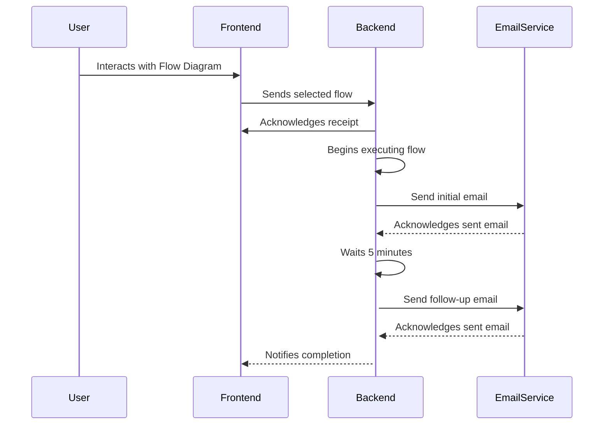
```mermaid
sequenceDiagram
    participant User as User
    participant Frontend as Frontend
    participant Backend as Backend
    participant EmailService as EmailService

    User->>Frontend: Interacts with Flow Diagram
    Frontend->>Backend: Sends selected flow
    Backend->>Frontend: Acknowledges receipt
    Backend->>Backend: Begins executing flow
    Backend->>EmailService: Send initial email
    EmailService-->>Backend: Acknowledges sent email
    Backend->>+Backend: Waits 5 minutes
    Backend->>EmailService: Send follow-up email
    EmailService-->>Backend: Acknowledges sent email
    Backend-->>Frontend: Notifies completion
```

This diagram depicts a user interacting with the frontend flow diagram. The frontend then communicates this to the backend. After acknowledging the receipt of the flow to the frontend, the backend starts executing the flow by triggering the email service to send the initial email and then waits for 5 minutes to send the follow-up email.

Remember that this is a simplified view and your actual sequence may involve more steps or different participants based on your exact requirements and system design. For example, you might want to handle potential errors and add steps to ensure the email was sent successfully. 

Make sure to replace the `EmailService` participant with your actual service or function responsible for sending the emails. The `Backend` participant should include your server or the part of your system that processes the diagram flow. The `Frontend` represents your React application or wherever you host your React Flow diagrams.

Note that Mermaid diagrams are not natively supported in all markdown processors, so make sure the platform you're using supports them, or use an online Mermaid live editor.

## Using a db layer

Using a database can be beneficial for persisting the chain of instructions and their state, especially in complex flows or when you want to save or resume work.

This is a general approach to storing your React Flow diagrams and processing them as a sequence of logic in your backend:

1. [**Persist the React Flow Diagram:**](1_presist-the-react-flow-diagram.md) React Flow provides you with the state of the entire diagram in a format that can be easily serialized to JSON. This includes the positions of nodes and their connections. When a user creates a diagram, you can save this state in your database. You might create a Diagram table in your database with a JSON or a similar type column to store this state.

2. [**Model the instructions in your database:**](2_model-the-instructions-in-your-database.md) Each node in your React Flow diagram corresponds to an instruction or action that your backend needs to take. You might create another table (let's call it `Instructions`) to store the logic corresponding to each node. Each instruction might include the type of the action (like "send email", "wait", etc.), any parameters it needs (like the email address to send to, or the time to wait), and a foreign key to the Diagram it belongs to.

3. [**Link Diagrams and Instructions:**](3_link-diagrams-and-instructions.md) Now that you have a way to store the state of the diagram and the logic of each instruction, you can link them together. Each node in your Diagram can be associated with an instruction in the Instructions table. You might do this by giving each node and instruction a unique identifier and storing this in your Diagram's JSON.

4. [**Process the Diagram:**](4_process-the-diagram.md) When it's time to process a diagram, your backend can load the Diagram state from your database and traverse it. For each node it visits, it can look up the corresponding Instruction and execute it. This will allow it to perform complex logic flows defined by the front-end diagram.

This is a simplified view of how you might design your system, and the actual implementation will depend on your specific requirements and constraints. This includes how you handle errors, how you allow diagrams to be modified, and more. But it should serve as a good starting point for designing a system that can store and execute React Flow diagrams as backend logic.

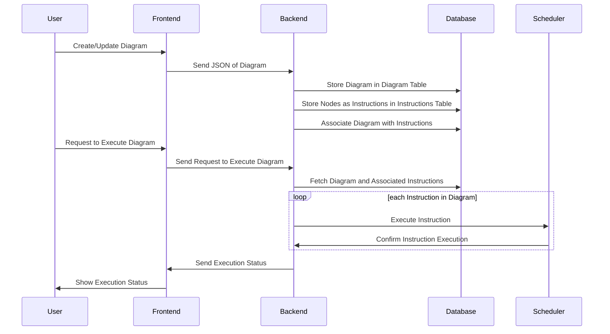
```mermaid
sequenceDiagram
    participant U as User
    participant F as Frontend
    participant B as Backend
    participant D as Database
    participant S as Scheduler
    U->>F: Create/Update Diagram
    F->>B: Send JSON of Diagram
    B->>D: Store Diagram in Diagram Table
    B->>D: Store Nodes as Instructions in Instructions Table
    B->>D: Associate Diagram with Instructions
    U->>F: Request to Execute Diagram
    F->>B: Send Request to Execute Diagram
    B->>D: Fetch Diagram and Associated Instructions
    loop each Instruction in Diagram
        B->>S: Execute Instruction
        S->>B: Confirm Instruction Execution
    end
    B->>F: Send Execution Status
    F->>U: Show Execution Status
```

## Encapsulates the Full App logic

Sure, here's a sequence diagram that encapsulates the logic from the beginning till now:

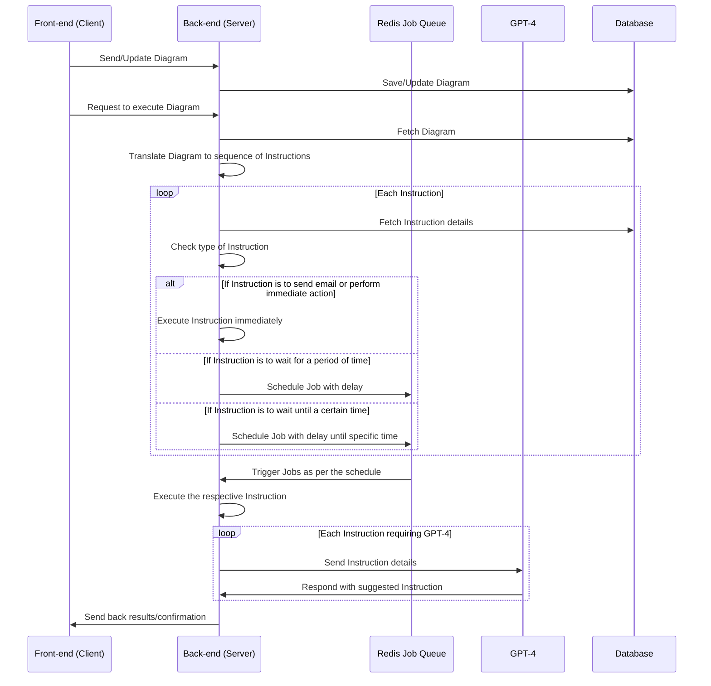
```mermaid
sequenceDiagram
    participant Client as Front-end (Client)
    participant Server as Back-end (Server)
    participant Redis as Redis Job Queue
    participant GPT as GPT-4
    participant DB as Database
    Client->>Server: Send/Update Diagram
    Server->>DB: Save/Update Diagram
    Client->>Server: Request to execute Diagram
    Server->>DB: Fetch Diagram
    Server->>Server: Translate Diagram to sequence of Instructions
    loop Each Instruction
        Server->>DB: Fetch Instruction details
        Server->>Server: Check type of Instruction
        alt If Instruction is to send email or perform immediate action
            Server->>Server: Execute Instruction immediately
        else If Instruction is to wait for a period of time
            Server->>Redis: Schedule Job with delay
        else If Instruction is to wait until a certain time
            Server->>Redis: Schedule Job with delay until specific time
        end
    end
    Redis->>Server: Trigger Jobs as per the schedule
    Server->>Server: Execute the respective Instruction
    loop Each Instruction requiring GPT-4
        Server->>GPT: Send Instruction details
        GPT->>Server: Respond with suggested Instruction
    end
    Server->>Client: Send back results/confirmation
```

This diagram represents an encapsulation of all steps from storing diagrams, executing instructions, handling different types of instructions, using GPT-4 for suggestions, to sending results back to the client.

It should be noted that this diagram simplifies some details for clarity. The actual implementation would need to handle things like error conditions, retries, server crashes, etc., as previously discussed.


## Examples

### Example 01 (Send Email)

First, let's talk about modeling the instructions in your database. Instructions can be thought of as individual units of work or tasks that you want to execute. 

For example, an instruction could be "Send an Email". This would require some parameters like "to", "from", "subject", and "body". 

You can model this as a table (or collection if you are using a NoSQL database) like so:

```
`Instruction Table`
-------------------
ID    | InstructionType | Params
1     | 'send_email'    | {'to': 'example@example.com', 'from': 'noreply@myservice.com', 'subject': 'Hello', 'body': 'Hello, World'}
```


Here is the mermaid sequence diagram for creating an instruction:

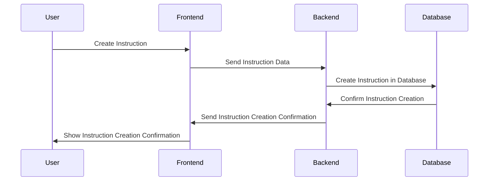
```mermaid
sequenceDiagram
    participant U as User
    participant F as Frontend
    participant B as Backend
    participant D as Database
    U->>F: Create Instruction
    F->>B: Send Instruction Data
    B->>D: Create Instruction in Database
    D->>B: Confirm Instruction Creation
    B->>F: Send Instruction Creation Confirmation
    F->>U: Show Instruction Creation Confirmation
```

Next, you'll want to link diagrams and instructions together. This would likely involve another table that acts as a join table between your Diagrams and Instructions. 

For example:

```
Diagram_Instruction Table
--------------------------
Diagram_ID | Instruction_ID | Order
1          | 1              | 1
```

In this example, the `Order` column can represent the sequence in which instructions should be executed in a particular diagram.

Mermaid sequence diagram for linking diagram with instruction:

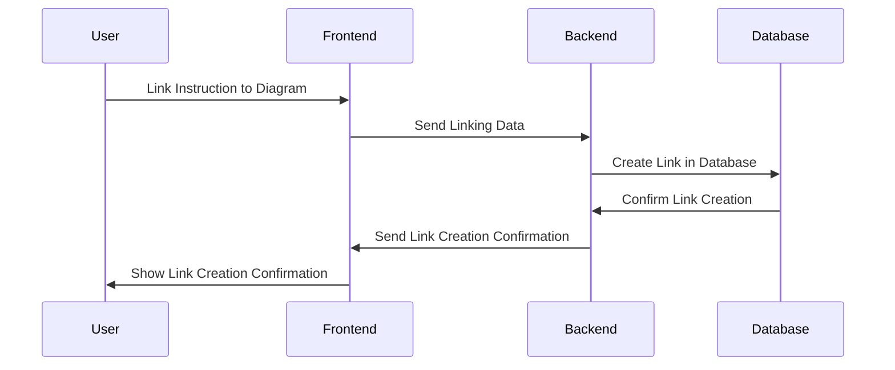
```mermaid
sequenceDiagram
    participant U as User
    participant F as Frontend
    participant B as Backend
    participant D as Database
    U->>F: Link Instruction to Diagram
    F->>B: Send Linking Data
    B->>D: Create Link in Database
    D->>B: Confirm Link Creation
    B->>F: Send Link Creation Confirmation
    F->>U: Show Link Creation Confirmation
```

Finally, when processing a diagram, the backend would fetch the diagram and its associated instructions, execute them in the specified order, and return the results.

This is an example of processing a diagram:

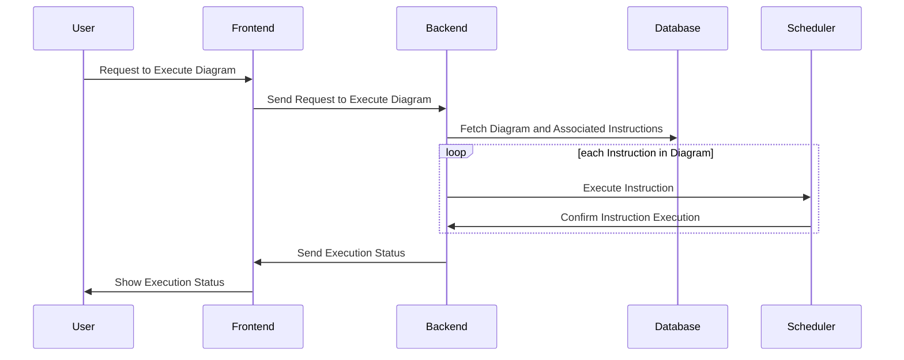
```mermaid
sequenceDiagram
    participant U as User
    participant F as Frontend
    participant B as Backend
    participant D as Database
    participant S as Scheduler
    U->>F: Request to Execute Diagram
    F->>B: Send Request to Execute Diagram
    B->>D: Fetch Diagram and Associated Instructions
    loop each Instruction in Diagram
        B->>S: Execute Instruction
        S->>B: Confirm Instruction Execution
    end
    B->>F: Send Execution Status
    F->>U: Show Execution Status
```

In this sequence, the user sends a request to execute a diagram, the frontend sends the request to the backend, the backend fetches the diagram and associated instructions, and then it executes the instructions one by one, updating the frontend (and thereby the user) about the status.

### Example 2 ( a user who wants to create a diagram that consists of two instructions: Send an email, and then send a notification.)

Let's take an example of a user who wants to create a diagram that consists of two instructions: Send an email, and then send a notification.

**1. Model the instructions in your database**

In this case, our database would look something like this:

```
`Instruction Table`
-------------------
ID | InstructionType   | Params  
1  | SendEmail         | { "email": "user@example.com", "subject": "Hello", "message": "Hello world" }  
2  | SendNotification  | { "userID": "123", "message": "Your email has been sent" }  
```

In this table, `ID` is the unique identifier for each instruction, `InstructionType` is the type of action that the instruction represents (sending an email or notification in this case), and `Params` are the parameters needed for the instruction. The `Params` field can be a serialized JSON object containing necessary details.

**2. Link Diagrams and Instructions**

When a diagram is created in the React Flow interface, each node in the diagram would correspond to an instruction in the `Instruction Table`. You would also need a `DiagramInstructionLink` table to link diagrams with the instructions they consist of.

```
`DiagramInstructionLink Table`
------------------------------
 DiagramID  | InstructionID  | Order
 1          | 1              | 1
 1          | 2              | 2
```

In this table, `DiagramID` is the ID of the diagram, `InstructionID` is the ID of the instruction, and `Order` is the order of the instruction in the diagram.

**3. Process the Diagram**

When the diagram needs to be processed (for example, when the user clicks a "Run" button), the backend will fetch the instructions for the diagram in order and execute them.

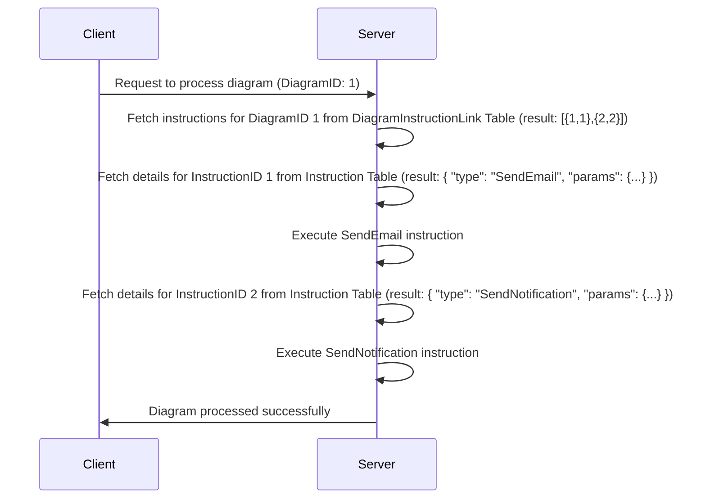
```mermaid
sequenceDiagram
    participant Client as Client
    participant Server as Server
    Client->>Server: Request to process diagram (DiagramID: 1)
    Server->>Server: Fetch instructions for DiagramID 1 from DiagramInstructionLink Table (result: [{1,1},{2,2}])
    Server->>Server: Fetch details for InstructionID 1 from Instruction Table (result: { "type": "SendEmail", "params": {...} })
    Server->>Server: Execute SendEmail instruction
    Server->>Server: Fetch details for InstructionID 2 from Instruction Table (result: { "type": "SendNotification", "params": {...} })
    Server->>Server: Execute SendNotification instruction
    Server->>Client: Diagram processed successfully
```

Note: Error handling, such as what to do if an instruction fails to execute, is not shown in this example but would be a necessary part of a real implementation. 

This is a simplified example, and your actual implementation may need to be more complex depending on your specific use case. For instance, if the instructions can have conditions or loops, your `Instruction Table` and `DiagramInstructionLink Table` might need to have additional fields to represent this. You may also need to account for concurrency if multiple diagrams can be processed at the same time.

###  Example 3 (Email marketing service)

#### Requirements

In this task we will create an email marketing campaign generator using react-flow as a UI, with the potential 2 diagrams as following:

```node
Diagram 01
----------
node compose email
node wait 3 days
node  send email
node  if email opened
node compose second email
node wait 3 days
node send second email 
node if email opened
node wait 2 minutes
node send sms

Diagram 2 contains nodes of:
node compose email
node wait until 2 am
node  send
node  if email opened 
node compose notification message
node wait 1 hour
node send notification 
node compose sms
node wait 5 days
node send sms
```

we will create generic nodes with parameters that can get adjusted. as following:

<table >
<tr>
<td>

**Diagram 01:**

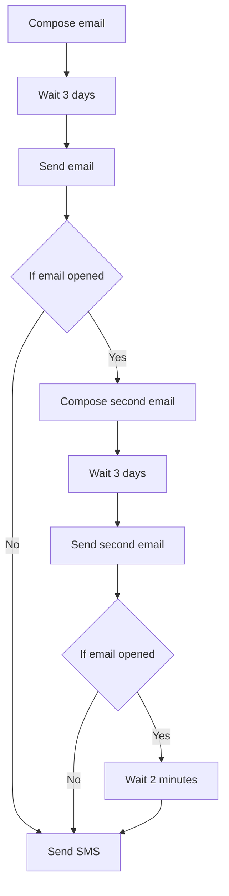
```mermaid
graph TD
    A[Compose email]
    B[Wait 3 days]
    C[Send email]
    D{If email opened}
    E[Compose second email]
    F[Wait 3 days]
    G[Send second email]
    H{If email opened}
    I[Wait 2 minutes]
    J[Send SMS]
    A-->B
    B-->C
    C-->D
    D-->|Yes|E
    D-->|No|J
    E-->F
    F-->G
    G-->H
    H-->|Yes|I
    H-->|No|J
    I-->J
```

</td>
<td>

**Diagram 2:**

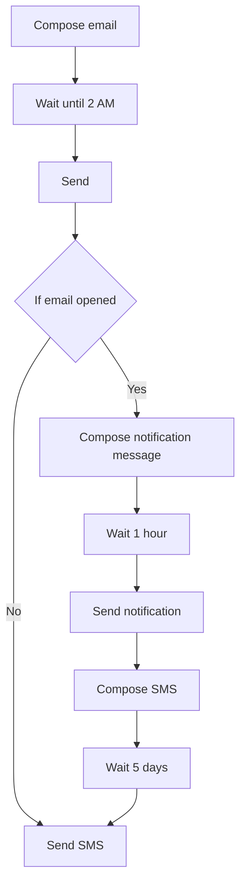
```mermaid
graph TD
    A[Compose email]
    B[Wait until 2 AM]
    C[Send]
    D{If email opened}
    E[Compose notification message]
    F[Wait 1 hour]
    G[Send notification]
    H[Compose SMS]
    I[Wait 5 days]
    J[Send SMS]
    A-->B
    B-->C
    C-->D
    D-->|Yes|E
    D-->|No|J
    E-->F
    F-->G
    G-->H
    H-->I
    I-->J
```

</td>
</tr>
</table>


------

First, let's define a format for the data we're storing in our tables. We'll store our instructions with associated parameters so they can be reused with different values. Our instructions will be similar to function calls, and the parameters will be similar to arguments to those functions.

For example, here are how we could define the tables and the instructions for both diagrams:

```
Diagram Table
-------------
ID    | DiagramName   
1     | 'Three-Day Follow-up Process'
2     | 'Delayed Messaging Process'

Instruction Table
-----------------
ID    | InstructionType         | **Params**
1     | 'compose_email'         | {'to': null, 'from': 'noreply@myservice.com', 'subject': null, 'body': null}
2     | 'wait'                  | {'duration': null}
3     | 'send_email'            | {'email_id': null}
4     | 'check_email_opened'    | {'email_id': null}
5     | 'compose_notification'  | {'message': null, 'recipient': null}
6     | 'send_notification'     | {'notification_id': null}
7     | 'compose_sms'           | {'message': null, 'recipient': null}
8     | 'send_sms'              | {'sms_id': null}

Diagram_Instruction Table (for Diagram 1)
-----------------------------------------
Diagram_ID | Instruction_ID | Order | Params
1          | 1              | 1     | {'to': 'example@example.com', 'subject': 'Hello', 'body': 'Hello, World'}
1          | 2              | 2     | {'duration': '3d'}
1          | 3              | 3     | {'email_id': 'result_from_instruction_1'}
1          | 4              | 4     | {'email_id': 'result_from_instruction_1'}
1          | 1              | 5     | {'to': 'example@example.com', 'subject': 'Follow Up', 'body': 'This is a follow up email'}
1          | 2              | 6     | {'duration': '3d'}
1          | 3              | 7     | {'email_id': 'result_from_instruction_5'}
1          | 4              | 8     | {'email_id': 'result_from_instruction_5'}
1          | 2              | 9     | {'duration': '2m'}
1          | 7              | 10    | {'message': 'Follow up SMS', 'recipient': 'example@example.com'}
1          | 8              | 11    | {'sms_id': 'result_from_instruction_10'}

Diagram_Instruction Table (for Diagram 2)
-----------------------------------------
Diagram_ID | Instruction_ID | Order | Params
2          | 1              | 1     | {'to': 'example@example.com', 'subject': 'Hello', 'body': 'Hello, World'}
2          | 2              | 2     | {'duration': 'until_2am'}
2          | 3              | 3     | {'email_id': 'result_from_instruction_1'}
2          | 4              | 4     | {'email_id': 'result_from_instruction_1'}
2          | 5              | 5     | {'message': 'Notification Message', 'recipient': 'example@example.com'}
2          | 2              | 6     | {'duration': '1h'}
2          | 6              | 7     | {'notification_id': 'result_from_instruction_5'}
2          | 7              | 8     | {'message': 'Follow up SMS', 'recipient': 'example@example.com'}
2          | 2              | 9     | {'duration': '5d'}
2          | 8              | 10    | {'sms_id': 'result_from_instruction_8'}
```
 obviously `Diagrams_Table` table could evolve into a bigger table that contains more information about the diagram below:

| id  | diagram_data | name             | description     | created_at           | updated_at           | created_by   |
|-----|--------------|------------------|-----------------|----------------------|----------------------|--------------|
| 1   | {JSON data of the diagram 1} | Email Campaign 1 | First email campaign | 2023-07-01 00:00:00 | 2023-07-01 00:00:00 | User1 |
| 2   | {JSON data of the diagram 2} | Email Campaign 2 | Second email campaign | 2023-07-02 00:00:00 | 2023-07-02 00:00:00 | User2 |

- `name`: This is the name of the diagram, which is used to identify the diagram in a user interface.
- `description`: This is a short description of the diagram. It could be used to provide more details about what the diagram is for or how it should be used.
- `created_at` and `updated_at`: These are timestamps that record when the diagram was created and when it was last updated. This can be useful for record-keeping and auditing purposes.
- `created_by`: This records which user created the diagram. This could be useful for systems with multiple users where you want to track who is responsible for creating or modifying diagrams.

And certainly, the `Instructions` table can be further enhanced with additional columns to better suit your needs. Here are a few suggestions:

| id  | diagram_id | node_id | type       | name   | description    | parameters                         | priority | scheduled_time          | retry_count | max_retry | created_at            | updated_at            |
|-----|------------|---------|------------|--------|----------------|------------------------------------|----------|-------------------------|-------------|-----------|-----------------------|-----------------------|
| 1   | 1          | 1       | compose_email | Compose Email | Compose initial email to customer. | {subject: 'Hello', body: 'World'}  | 1        | 2023-09-01 00:00:00 UTC | 0           | 3         | 2023-08-01 00:00:00 UTC | 2023-08-01 00:00:00 UTC |
| 2   | 1          | 2       | wait       | Wait Time  | Wait for 3 days before next step.  | {duration: '3 days'}               | 2        | null                    | 0           | 3         | 2023-08-01 00:00:00 UTC | 2023-08-01 00:00:00 UTC |
| 3   | 1          | 3       | send_email | Send Email | Send the composed email.           | {email_id: 1}                      | 1        | null                    | 0           | 3         | 2023-08-01 00:00:00 UTC | 2023-08-01 00:00:00 UTC |

- `name`: A friendly name for the instruction. It can be used for display purposes in your application's user interface.
- `description`: A more detailed description of the instruction. This can be used for documentation and can also be displayed to users to give them a better understanding of what the instruction does.
- `created_at` and `updated_at`: Timestamps for when the instruction was created and last updated. These can be useful for tracking changes over time, and can be used to sort or filter instructions in your application.

These are just suggestions, and you can certainly add other columns as necessary. For example, you might add columns to store the status of an instruction (e.g., 'pending', 'completed', 'failed'), a `last_run_at` column to store the last time the instruction was executed, or even a `created_by` column to track which user created the instruction.

Here, we have our Diagrams stored in the `Diagram` table, each with a unique identifier and a name. In the `Instruction` table, we have generic instructions, where each one is a kind of action to perform, like `compose_email`, `wait`, `send_email`, and so on. 

The actual instances of each instruction are stored in the `Diagram_Instruction` table, with the order they should be performed in for each diagram and any specific parameters they need. Here, `Params` represents the parameters needed for the instruction. Notice that some parameters like `'result_from_instruction_1'` indicate that the output/result from a previous instruction is used as an input to the next.

Now, when the user triggers the process, the back-end can fetch all the instructions for the diagram, ordered by the `Order` column. It then executes each one in order, passing the `Params` to the instruction.

This is how the execution might look for Diagram 1:

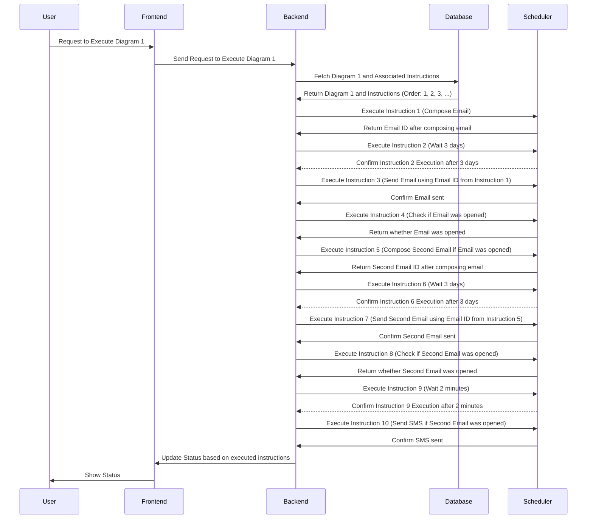
```mermaid
sequenceDiagram
    participant U as User
    participant F as Frontend
    participant B as Backend
    participant D as Database
    participant S as Scheduler
    U->>F: Request to Execute Diagram 1
    F->>B: Send Request to Execute Diagram 1
    B->>D: Fetch Diagram 1 and Associated Instructions
    D->>B: Return Diagram 1 and Instructions (Order: 1, 2, 3, ...)
    B->>S: Execute Instruction 1 (Compose Email)
    S->>B: Return Email ID after composing email
    B->>S: Execute Instruction 2 (Wait 3 days)
    S-->>B: Confirm Instruction 2 Execution after 3 days
    B->>S: Execute Instruction 3 (Send Email using Email ID from Instruction 1)
    S->>B: Confirm Email sent
    B->>S: Execute Instruction 4 (Check if Email was opened)
    S->>B: Return whether Email was opened
    B->>S: Execute Instruction 5 (Compose Second Email if Email was opened)
    S->>B: Return Second Email ID after composing email
    B->>S: Execute Instruction 6 (Wait 3 days)
    S-->>B: Confirm Instruction 6 Execution after 3 days
    B->>S: Execute Instruction 7 (Send Second Email using Email ID from Instruction 5)
    S->>B: Confirm Second Email sent
    B->>S: Execute Instruction 8 (Check if Second Email was opened)
    S->>B: Return whether Second Email was opened
    B->>S: Execute Instruction 9 (Wait 2 minutes)
    S-->>B: Confirm Instruction 9 Execution after 2 minutes
    B->>S: Execute Instruction 10 (Send SMS if Second Email was opened)
    S->>B: Confirm SMS sent
    B->>F: Update Status based on executed instructions
    F->>U: Show Status
```

The process for Diagram 2 would be similar. Please note that checking if an email was opened and waiting until a specific time are non-trivial tasks and would require additional infrastructure that's beyond the scope of this example.

As for handling exceptions, you would typically want some kind of error handling at each step of the process. For instance, if an instruction fails to execute (like if sending the email fails), you might have the backend send a message to the frontend to update the status to show the failure. You could also potentially have retry logic in place to attempt the instruction again after a certain amount of time or under certain conditions. 

This overview should give you an idea of how to architect such a system using a combination of React Flow for the front-end diagram creation and a back-end that processes these diagrams as a sequence of instructions. The specifics will depend greatly on the details of your application and its requirements.


The process for Diagram 2 would be similar. Please note that checking if an email was opened and waiting until a specific time are non-trivial tasks and would require additional infrastructure that's beyond the scope of this example.

As for handling exceptions, you would typically want some kind of error handling at each step of the process. For instance, if an instruction fails to execute (like if sending the email fails), you might have the backend send a message to the frontend to update the status to show the failure. You could also potentially have retry logic in place to attempt the instruction again after a certain amount of time or under certain conditions. 

This overview should give you an idea of how to architect such a system using a combination of React Flow for the front-end diagram creation and a back-end that processes these diagrams as a sequence of instructions. The specifics will depend greatly on the details of your application and its requirements.

#### Handling Exceptions:
Your backend needs to be robust and able to handle exceptions gracefully. For example, when executing an instruction, there might be an error such as a failure in sending an email. In such cases, you could retry the operation or report it to the frontend, depending on the nature of the error.

This is how you might handle exceptions for Instruction 3 (sending email) of Diagram 1:

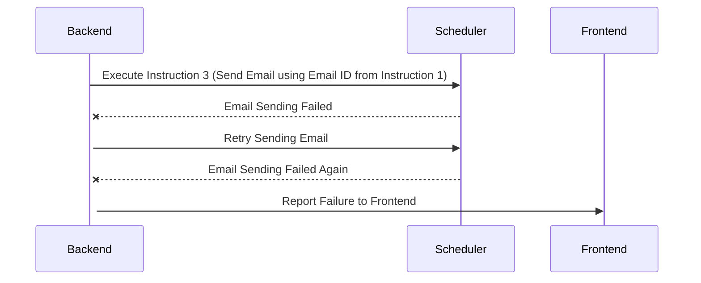
```mermaid
sequenceDiagram
    participant B as Backend
    participant S as Scheduler
    participant F as Frontend
    B->>S: Execute Instruction 3 (Send Email using Email ID from Instruction 1)
    S--x+B: Email Sending Failed
    B->>S: Retry Sending Email
    S--x+B: Email Sending Failed Again
    B->>F: Report Failure to Frontend
```

#### Status Reporting:

While executing each instruction, you can have the backend send status updates to the frontend. The frontend can then update the diagram or display notifications to the user based on these updates.

Real-time Updates:
For real-time updates, you can use websockets or similar technology to keep a live connection between your frontend and backend. This way, as soon as tThis is a status update on the backend, it can be immediately pushed to the frontend.

This is how real-time updates might look:

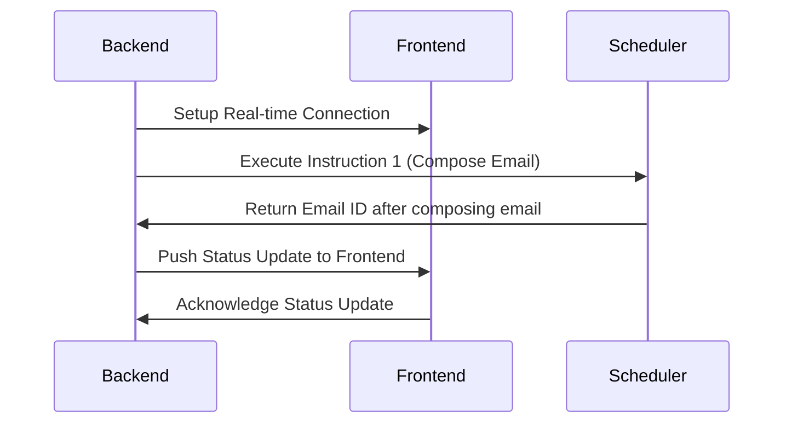
```mermaid
sequenceDiagram
    participant B as Backend
    participant F as Frontend
    participant S as Scheduler
    B->>F: Setup Real-time Connection
    B->>S: Execute Instruction 1 (Compose Email)
    S->>B: Return Email ID after composing email
    B->>F: Push Status Update to Frontend
    F->>B: Acknowledge Status Update

```

By following this approach, you can have a highly interactive and responsive system that executes a series of instructions based on user-defined diagrams, and provides real-time feedback on the execution of those instructions. The specific implementation details will depend on your specific needs and the technologies you're working with.


#### Retry Mechanism:

For critical tasks that may fail due to reasons like network issues, providing a retry mechanism can be very beneficial. This can be as simple as attempting the action again after a set delay or as complex as exponential backoff with a maximum retry limit.

This is a sequence for retrying an email send operation:

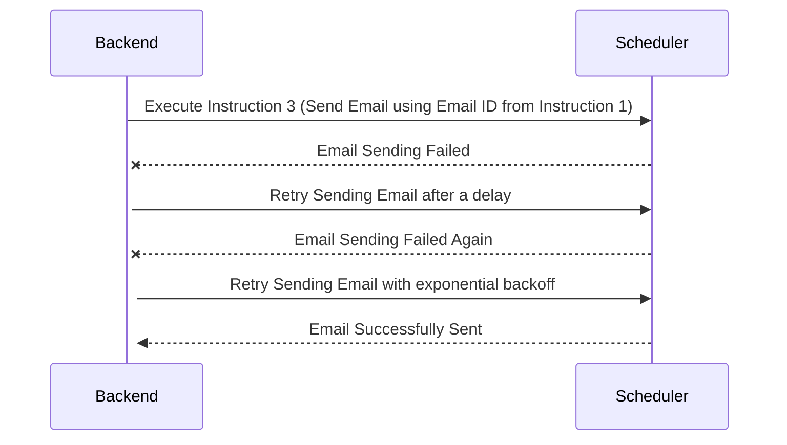
```mermaid
sequenceDiagram
    participant B as Backend
    participant S as Scheduler
    B->>S: Execute Instruction 3 (Send Email using Email ID from Instruction 1)
    S--x+B: Email Sending Failed
    B->>S: Retry Sending Email after a delay
    S--x+B: Email Sending Failed Again
    B->>S: Retry Sending Email with exponential backoff
    S-->>B: Email Successfully Sent
```

#### Task Priorities:
If you have tasks of varying importance, you may want to prioritize more critical tasks. The priority could be an attribute of the task itself, or it could be derived from the associated diagram. In general, you'll need to ensure your backend can accommodate this level of scheduling complexity.

This is a sequence for processing two tasks with different priorities:

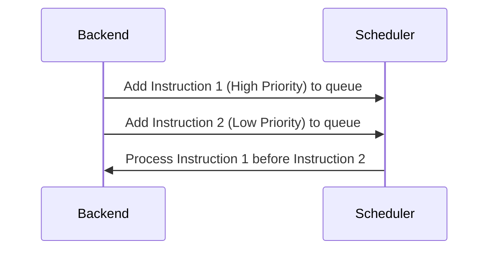
```mermaid
sequenceDiagram
    participant B as Backend
    participant S as Scheduler
    B->>S: Add Instruction 1 (High Priority) to queue
    B->>S: Add Instruction 2 (Low Priority) to queue
    S->>B: Process Instruction 1 before Instruction 2
```

#### Task Scheduling:
While immediate execution is appropriate for some tasks, others might need to be scheduled for a later time. Your backend should have the capability to schedule tasks at specific times or after certain delays. 

This is a sequence for scheduling a task:

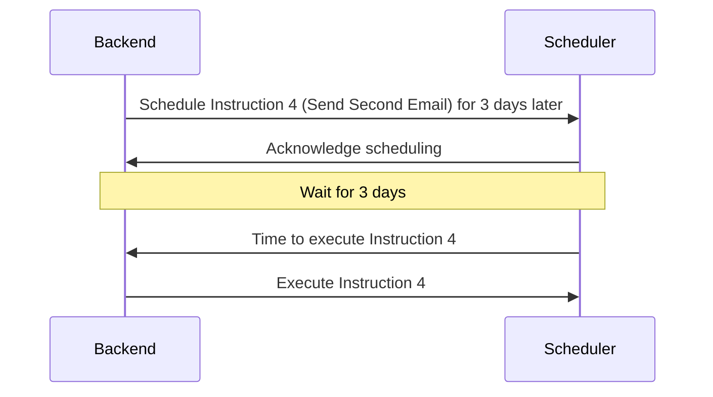
```mermaid
sequenceDiagram
    participant B as Backend
    participant S as Scheduler
    B->>S: Schedule Instruction 4 (Send Second Email) for 3 days later
    S->>B: Acknowledge scheduling
    Note over B,S: Wait for 3 days
    S->>B: Time to execute Instruction 4
    B->>S: Execute Instruction 4
```

By incorporating these mechanisms into your backend, you can create a more robust, flexible, and user-friendly system. It's important to note that all these features need to be reflected in your data models, both for the diagrams and the instructions. This might require adding fields to your tables, such as retry_count, priority, or scheduled_time.

#### Synchronization

Synchronization of the `Diagram_Instruction` table and the `Diagram` table can be handled through application logic in your backend service. Here are some general steps:

1. **Retrieving the Diagram**: When the user wants to open a diagram, the application will first retrieve the diagram data from the `Diagram` table using the diagram's unique ID.

2. **Retrieving the Instructions**: Once the diagram data has been retrieved, the application will use the diagram's ID to fetch all the associated instructions from the `Diagram_Instruction` table.

3. **Combining the Data**: The diagram data and the instructions are combined into a single data structure which is then sent to the front end.

4. **Front End Display**: Your front-end application can then use this data structure to display the diagram and its associated instructions.

5. **Updating the Diagram**: If a user edits the diagram in the UI, the changes are sent back to the backend service. The backend service will update the `Diagram` and `Diagram_Instruction` tables to reflect these changes. For example, if a user deletes a node, the backend would delete the corresponding instruction in the `Diagram_Instruction` table.

6. **Concurrency and Consistency**: You might also want to consider how you handle concurrency issues. If two users are editing the same diagram at the same time, you need to decide how to handle this. One approach is to use optimistic locking, where you keep track of a version number for each diagram. When a user tries to save changes to a diagram, you check if the version number they have matches the current version number in the database. If it doesn't, that means someone else has made changes since they started editing, and you can handle this situation appropriately (e.g., by showing an error message, merging the changes, etc.) as demonstrated below in the sequence chart.

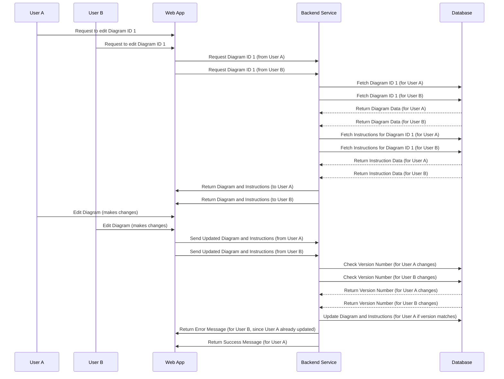
```mermaid
sequenceDiagram
participant User A
participant User B
participant Web App
participant Backend Service
participant Database

User A->>Web App: Request to edit Diagram ID 1
User B->>Web App: Request to edit Diagram ID 1
Web App->>Backend Service: Request Diagram ID 1 (from User A)
Web App->>Backend Service: Request Diagram ID 1 (from User B)
Backend Service->>Database: Fetch Diagram ID 1 (for User A)
Backend Service->>Database: Fetch Diagram ID 1 (for User B)
Database-->>Backend Service: Return Diagram Data (for User A)
Database-->>Backend Service: Return Diagram Data (for User B)
Backend Service->>Database: Fetch Instructions for Diagram ID 1 (for User A)
Backend Service->>Database: Fetch Instructions for Diagram ID 1 (for User B)
Database-->>Backend Service: Return Instruction Data (for User A)
Database-->>Backend Service: Return Instruction Data (for User B)
Backend Service->>Web App: Return Diagram and Instructions (to User A)
Backend Service->>Web App: Return Diagram and Instructions (to User B)
User A->>Web App: Edit Diagram (makes changes)
User B->>Web App: Edit Diagram (makes changes)
Web App->>Backend Service: Send Updated Diagram and Instructions (from User A)
Web App->>Backend Service: Send Updated Diagram and Instructions (from User B)
Backend Service->>Database: Check Version Number (for User A changes)
Backend Service->>Database: Check Version Number (for User B changes)
Database-->>Backend Service: Return Version Number (for User A changes)
Database-->>Backend Service: Return Version Number (for User B changes)
Backend Service->>Database: Update Diagram and Instructions (for User A if version matches)
Backend Service->>Web App: Return Error Message (for User B, since User A already updated)
Backend Service->>Web App: Return Success Message (for User A)
```

In this scenario, the diagram is requested almost simultaneously by User A and User B. Both users then make changes to the diagram. When the changes are sent to the backend, User A's changes are processed first, and the version number in the `Diagram` table is incremented. When User B's changes are processed, the backend service detects a version mismatch and sends an error message back to the web application for User B. This could trigger a refresh of the diagram for User B, giving them the updated version that includes User A's changes.

This is just one way to handle concurrency, and it may or may not suit your specific needs. In a more sophisticated system, you might want to provide a way for users to merge their changes, or to "lock" the diagram while someone is editing it to prevent other users from making changes at the same time.

##### Example

Consider a web application where users can create and edit flow diagrams. The application uses two tables in its database: 

1. **Diagram**: Stores basic information about each diagram.

| ID | Name                 | Version   |
| -- | -------------------- | --------- |
| 1  | User Signup Process  | 3         |
| 2  | Email Sequence       | 2         |

1. **Diagram_Instruction**: Stores the nodes or instructions for each diagram. 

| Diagram_ID | Node_ID | Node_Type | Parameters |
| ---------- | ------- | --------- | ---------- |
| 1          | A       | Compose Email | { "subject": "Welcome", "body": "Welcome to our service!" } |
| 1          | B       | Wait | { "duration": "3 days" } |
| 1          | C       | Send Email | {} |
| 1          | D       | Check Email Opened | {} |
| 2          | E       | Compose Email | { "subject": "New features", "body": "Check out our new features!" } |
| 2          | F       | Wait Until | { "time": "2 am" } |
| 2          | G       | Send Email | {} |
| 2          | H       | Check Email Opened | {} |


User A wants to edit the "User Signup Process" diagram. This is how the process can look:

1. User A opens the web application and requests to edit the "User Signup Process" diagram.
2. The application sends a request to the backend service, asking for data for the diagram with ID 1.
3. The backend service retrieves the diagram data from the `Diagram` table.
4. The backend service retrieves the associated instructions from the `Diagram_Instruction` table.
5. The backend service sends the diagram data and instructions back to the web application.
6. User A makes some changes to the diagram (e.g., adding a new node or deleting an existing one).
7. The web application sends the updated diagram data and instructions back to the backend service.
8. The backend service checks the current version number in the `Diagram` table.
9. If the version number matches the one provided by the web application, the backend service updates the `Diagram` and `Diagram_Instruction` tables. It also increments the version number in the `Diagram` table.
10. If the version number doesn't match (indicating that someone else has made changes), the backend service sends an error message to the web application. The web application can then handle this situation appropriately (e.g., by showing an error message to User A).

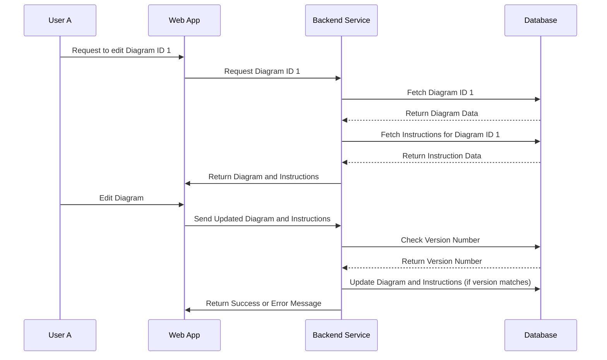
```mermaid
sequenceDiagram
participant User A
participant Web App
participant Backend Service
participant Database
User A->>Web App: Request to edit Diagram ID 1
Web App->>Backend Service: Request Diagram ID 1
Backend Service->>Database: Fetch Diagram ID 1
Database-->>Backend Service: Return Diagram Data
Backend Service->>Database: Fetch Instructions for Diagram ID 1
Database-->>Backend Service: Return Instruction Data
Backend Service->>Web App: Return Diagram and Instructions
User A->>Web App: Edit Diagram
Web App->>Backend Service: Send Updated Diagram and Instructions
Backend Service->>Database: Check Version Number
Database-->>Backend Service: Return Version Number
Backend Service->>Database: Update Diagram and Instructions (if version matches)
Backend Service->>Web App: Return Success or Error Message
```

This is a simplification, and you'll need to adjust this to suit your specific application and requirements. For

 example, you might need to handle situations where the user makes changes offline, or you might want to provide a way for users to resolve conflicts if two people try to edit the same diagram at the same time.

##### implementation example

Sure, let's implement a simple example of the "User Signup Process" sequence using Node.js (Express) as our backend service and a mock database:

**Backend Server (Express.js)**

Let's assume we have an endpoint that fetches a diagram by ID.

```javascript
const express = require('express');
const app = express();
app.use(express.json());

// Mock database
const Diagrams = [
  { id: 1, name: 'User Signup Process', version: 3 },
  // ...
];
const Diagram_Instructions = [
  { diagramId: 1, nodeId: 'A', nodeType: 'Compose Email', parameters: { subject: 'Welcome', body: 'Welcome to our service!' }},
  { diagramId: 1, nodeId: 'B', nodeType: 'Wait', parameters: { duration: '3 days' }},
  // ...
];

app.get('/diagrams/:id', (req, res) => {
  const diagramId = Number(req.params.id);
  const diagram = Diagrams.find(d => d.id === diagramId);
  const instructions = Diagram_Instructions.filter(i => i.diagramId === diagramId);
  
  res.json({ diagram, instructions });
});

app.listen(3000, () => console.log('Server listening on port 3000'));
```

Here, when you access `http://localhost:3000/diagrams/1`, it would return the diagram and its corresponding instructions.

Similarly, you can add endpoints for creating, updating, and deleting diagrams and instructions.

**Frontend (React.js)**

Let's assume you're using `fetch` to call the backend service and fetch the diagram data:

```javascript
class Diagram extends React.Component {
  state = { diagram: null, instructions: [] };
  
  componentDidMount() {
    fetch('http://localhost:3000/diagrams/1')
      .then(res => res.json())
      .then(({ diagram, instructions }) => this.setState({ diagram, instructions }))
      .catch(err => console.error(err));
  }
  
  render() {
    const { diagram, instructions } = this.state;
    if (!diagram) return <div>Loading...</div>;
    
    return (
      <div>
        <h1>{diagram.name} (version {diagram.version})</h1>
        {instructions.map(i => (
          <div key={i.nodeId}>
            <h2>{i.nodeType}</h2>
            <p>{JSON.stringify(i.parameters)}</p>
          </div>
        ))}
      </div>
    );
  }
}
```

In this code, when the `Diagram` component is mounted, it fetches the diagram and its instructions from the backend service and stores them in its state. Then, it renders the diagram and its instructions.

This is a basic setup. In a real-world application, you'd also need to add error handling and possibly more complex state management. You'd also need to implement functionality for editing diagrams, which could involve sending `PUT` or `PATCH` requests to the backend service.

Example:

1. Frontend: Your React component that allows editing the diagram

```javascript
import React, { useEffect, useState } from 'react';

const EditDiagram = ({ diagramId }) => {
    const [diagram, setDiagram] = useState(null);
    const [instructions, setInstructions] = useState(null);

    useEffect(() => {
        fetch(`/api/diagrams/${diagramId}`)
            .then(response => response.json())
            .then(data => {
                setDiagram(data.diagram);
                setInstructions(data.instructions);
            });
    }, [diagramId]);

    // receives
    // data.diagram =  { id: 1, name: 'User Signup Process', version: 3 }
    // data.instructions = [
    // { diagramId: 1, nodeId: 'A', nodeType: 'Compose Email', parameters: { subject: 'Welcome', body: 'Welcome to our service!' }},
    // { diagramId: 1, nodeId: 'B', nodeType: 'Wait', parameters: { duration: '3 days' }},
    // ...
    // ]
    
    const handleSave = () => {
        const payload = {
            diagram: diagram,
            instructions: instructions
        };

        fetch(`/api/diagrams/${diagramId}`, {
            method: 'PUT',
            headers: {
                'Content-Type': 'application/json',
            },
            body: JSON.stringify(payload),
        }).then(response => {
            // handle response, such as notifying the user of success
        });
    };

    // Your diagram editor goes here, use diagram and instructions state
    // When user clicks save, handleSave should be called

    return (
        <div>
            {/* Diagram editor component here */}
            <button onClick={handleSave}>Save</button>
        </div>
    );
};
```

2. Backend: Handling the request to retrieve and update the diagram (Express.js example)

```javascript
const express = require('express');
const app = express();
const port = 3000;

app.use(express.json());

// Get diagram
app.get('/api/diagrams/:id', (req, res) => {
    const diagramId = req.params.id;
    
    // Example: Fetch diagram and instructions from database (pseudo-code)
    const diagram = database.getDiagramById(diagramId);
    const instructions = database.getInstructionsByDiagramId(diagramId);

    res.json({
        diagram: diagram,
        instructions: instructions
    });
});

// Update diagram
app.put('/api/diagrams/:id', (req, res) => {
    const diagramId = req.params.id;
    const { diagram, instructions } = req.body;

    // Example: Update diagram and instructions in the database (pseudo-code)
    database.updateDiagram(diagramId, diagram);
    database.updateInstructions(diagramId, instructions);

    res.json({ success: true });
});

app.listen(port, () => {
    console.log(`Server listening at http://localhost:${port}`);
});
```

3. Database: (pseudo-code for functions to fetch and update data)

```javascript
const database = {
    getDiagramById: (diagramId) => {
        // Fetch diagram from database by ID
        // Return diagram
    },

    getInstructionsByDiagramId: (diagramId) => {
        // Fetch instructions related to diagramId from the database
        // Return instructions
    },

    updateDiagram: (diagramId, diagram) => {
        // Update diagram in the database
    },

    updateInstructions: (diagramId, instructions) => {
        // Update instructions in the database
    }
};
```

###### Merging Diagram & Diagram_Instructions tables

On the backend, you would perform a JOIN operation between the `Diagram` and `Diagram_Instruction` tables using the node ID as the common key. The exact way to do this will depend on the specific database and language you're using, but the concept is the same.

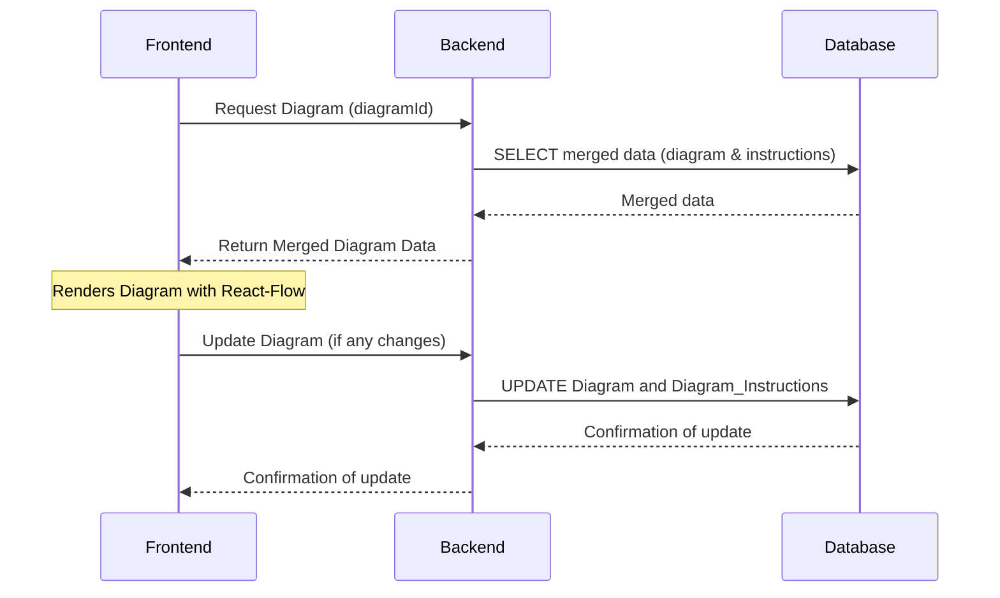
```mermaid
sequenceDiagram
    participant FE as Frontend
    participant BE as Backend
    participant DB as Database

    FE->>BE: Request Diagram (diagramId)
    BE->>DB: SELECT merged data (diagram & instructions)
    DB-->>BE: Merged data
    BE-->>FE: Return Merged Diagram Data
    Note over FE: Renders Diagram with React-Flow
    FE->>BE: Update Diagram (if any changes)
    BE->>DB: UPDATE Diagram and Diagram_Instructions
    DB-->>BE: Confirmation of update
    BE-->>FE: Confirmation of update
```

**Requesting Diagram:**

- Data before merging:
   
    a. `diagram`
    
    ```json
    {
        "id": 1,
        "nodes": [
            {
                "id": "1",
                "type": "composeEmail",
                "data": { "label": "Compose Email" },
                "position": { "x": 100, "y": 100 }
            },
            {
                "id": "2",
                "type": "wait",
                "data": { "label": "Wait 3 Days", "duration": 3 },
                "position": { "x": 300, "y": 100 }
            },
            ...
        ],
        "edges": [
            { "id": "e1-2", "source": "1", "target": "2" },
            ...
        ]
    }
    ```
    
    b. `diagram_instructions`
    
    ```json
    [
        {
            "node_id": "1",
            "type": "composeEmail",
            "content": "Hello, this is an email",
            "to": "example@example.com"
        },
        {
            "node_id": "2",
            "type": "wait",
            "duration": "3d"
        },
        ...
    ]
    ```

    Explanation:

    - We are receiving `diagram` data which contains the structure of nodes and edges.
    - We are also receiving `diagram_instructions` data which contains additional logic for each node.
    - In the `Diagram` component, we're merging these two pieces of data so that each node in our diagram has the additional logic associated with it.
    - We use `ReactFlow` to render the diagram. The `elements` prop is given the complete set of nodes and edges to render.
    - We include some simple controls and a background for our diagram.


    ```javascript
    const { Client } = require('pg');
    const client = new Client();

    // Connect to the database
    await client.connect();

    // Fetch the diagram and instructions, merging them based on their node ID
    const res = await client.query(`
        SELECT d.id, d.type, d.position, i.data 
        FROM Diagrams d
        JOIN Diagram_Instructions i ON d.id = i.node_id
        WHERE d.diagram_id = $1
    `, [diagramId]);

    // Close the database connection
    await client.end();

    // Reshape the data for the front end
    const nodes = res.rows.map(row => ({
        id: row.id,
        type: row.type,
        position: row.position,
        data: row.data,
    }));

    // Fetch the edges for this diagram
    // Note: you would also want to handle this in your actual code
    const edges = await getEdgesForDiagram(diagramId);

    const diagramData = {
        nodes: nodes,
        edges: edges,
    };

    // Send the data back to the front end
    res.json(diagramData);
    ```

    After the merge, the structure of your response data might look something like this:

    ```json
    {
        "id": 1,
        "nodes": [
            {
                "id": "1",
                "type": "composeEmail",
                "data": { "label": "Compose Email", "content": "Hello, this is an email", "to": "example@example.com" },
                "position": { "x": 100, "y": 100 }
            },
            {
                "id": "2",
                "type": "wait",
                "data": { "label": "Wait 3 Days", "duration": 3 },
                "position": { "x": 300, "y": 100 }
            },
            ...
        ],
        "edges": [
            { "id": "e1-2", "source": "1", "target": "2" },
            ...
        ]
    }
    ```

    You would then pass this data directly to the React-Flow component in your front-end code:

    ```javascript
    import React from 'react';
    import ReactFlow, { Controls, Background } from 'react-flow-renderer';

    const Diagram = ({ diagram }) => {
        return (
            <ReactFlow elements={diagram}>
                <Background variant="dots" gap={12} size={1} />
                <Controls />
            </ReactFlow>
        );
    };

    // Example usage:
    // <Diagram diagram={receivedDiagramData} />
    ```

**Updating Diagram**

Updating a diagram along with its associated instructions can be a bit more involved, as you need to handle both existing and potentially new nodes.

The following is a simplified example in Node.js, continuing the previous example using the `pg` library for PostgreSQL. This code would be placed in the endpoint that handles diagram updates from your front end.

```javascript
const { Client } = require('pg');
const client = new Client();

// Connect to the database
await client.connect();

// Assume the updated diagram data comes from the front-end in this shape:
/*
{
    "nodes": [
        { "id": "node_1", "type": "actionNode", "position": { "x": 0, "y": 0 }, "data": { "instructionId": "inst_1", "params": { "emailSubject": "Subject", "emailBody": "Hello there!" } } },
        // More nodes...
    ],
    "edges": [
        { "id": "edge_1", "source": "node_1", "target": "node_2" },
        // More edges...
    ]
}
*/
const diagramData = req.body;

// Start a transaction to ensure data consistency
await client.query('BEGIN');

try {
    // First, update the nodes
    for (const node of diagramData.nodes) {
        // Update the node in the Diagrams table
        await client.query(`
            UPDATE Diagrams
            SET type = $1, position = $2
            WHERE id = $3
        `, [node.type, node.position, node.id]);

        // Update the instruction in the Diagram_Instructions table
        await client.query(`
            UPDATE Diagram_Instructions
            SET data = $1
            WHERE node_id = $2
        `, [node.data, node.id]);
    }

    // Next, handle the edges in a similar way...
    for (const edge of diagramData.edges) {
        // Update the edge in the Edges table
        await client.query(`
            UPDATE Edges
            SET source = $1, target = $2
            WHERE id = $3
        `, [edge.source, edge.target, edge.id]);
    }

    // If there were no errors, commit the transaction
    await client.query('COMMIT');
} catch (err) {
    // If an error occurred, roll back the transaction
    await client.query('ROLLBACK');
    throw err;
} finally {
    // Close the database connection
    await client.end();
}

// Send a success response back to the front end
res.json({ success: true });
```

This is a simplified example. In a real-world scenario, you'd also need to handle deleting nodes/edges that were removed in the updated diagram, and inserting new nodes/edges that were added. 
