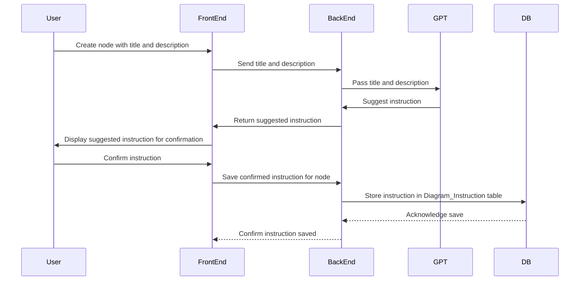
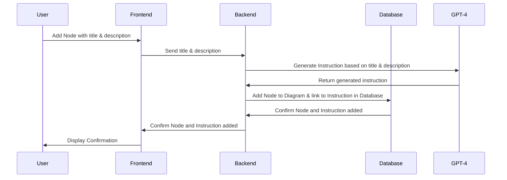
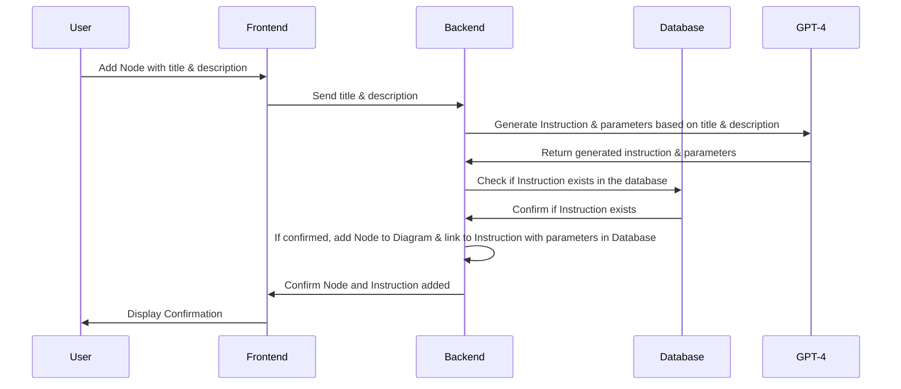
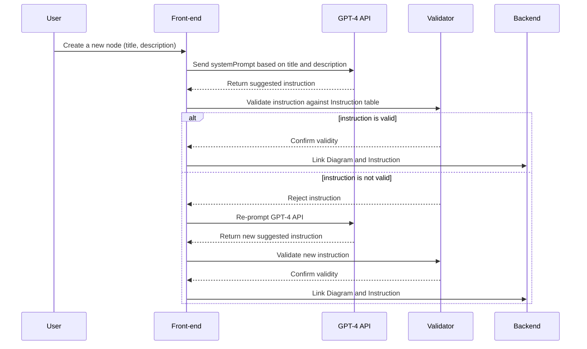
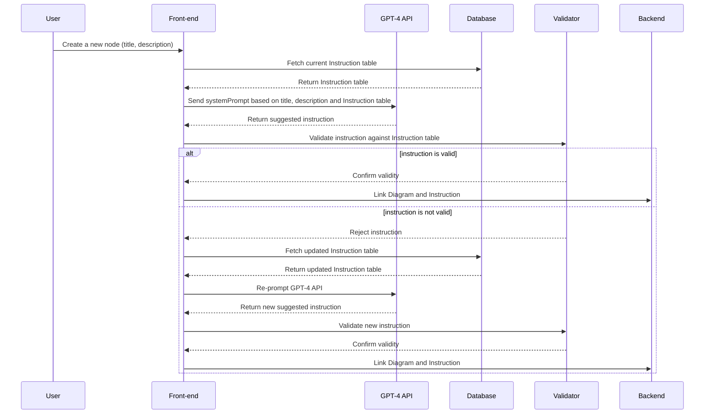

# GPT-4 to suggest node types or actions from a title and description

**table of content:**

- [GPT-4 to suggest node types or actions from a title and description](#gpt-4-to-suggest-node-types-or-actions-from-a-title-and-description)
  - [Handling Edge Cases and Re-prompting GPT-4](#handling-edge-cases-and-re-prompting-gpt-4)
    - [1. Re-prompting the AI](#1-re-prompting-the-ai)
  - [Maintaining Up-to-Date Instruction Tables and Error Handling in a Full-Stack Application](#maintaining-up-to-date-instruction-tables-and-error-handling-in-a-full-stack-application)
  - [Node.js Implementation for Dynamic Instruction Fetching and Validation in a Full-Stack Application](#nodejs-implementation-for-dynamic-instruction-fetching-and-validation-in-a-full-stack-application)
  - [Implementing GPT-4 Instruction Generation and Validation in a Node.js Application with Express, PostgreSQL, and OpenAI](#implementing-gpt-4-instruction-generation-and-validation-in-a-nodejs-application-with-express-postgresql-and-openai)


OpenAI's GPT can be useful for understanding natural language and making suggestions, but as of my last update in September 2021, it doesn't perform actions directly. Therefore, you could use it to understand the instruction from a title and description and suggest a node type or action to be associated with a node, but the actual execution of that logic will have to be implemented by you. 

For example, when creating a node, you could have a form field for "title" and "description". You could then send the title and description to your backend server, which uses GPT to process it and return suggested instruction.

Here's a high level sequence diagram to visualize it:



As GPT is a machine learning model, the suggestions might not always be accurate. Therefore, it's important to allow the user to confirm or edit the suggested instruction. 

Please also note that since GPT-4 uses the data up until 2021, for any new instruction type or method introduced after 2021 won't be recognized accurately.

Remember to keep user experience and performance considerations in mind when designing your system, as making a request to your backend and GPT for every node creation could slow down the user experience.

Lastly, using GPT to suggest instructions like this can be complex and might not be necessary depending on your use case. It's worth considering if there are simpler solutions to your problem, such as pre-defined instruction types that the user can select from.

In order to use GPT to understand instructions from a title and description in Node.js, you would need to use the OpenAI API. Please note that as of my last update in September 2021, OpenAI GPT-3 is the latest version available, and OpenAI provides a Node.js client library to interact with the API.

Here's an example of how you might use it:

1. First, install the OpenAI Node.js library:

```bash
npm install openai
```

2. Then, you can use the `openai.Completion.create` function to generate suggestions. Here's an example of how you could use it to generate an instruction suggestion from a title and description:

```javascript
const openai = require('openai');

openai.apiKey = 'your-openai-api-key';

async function getInstructionSuggestion(title, description) {
  const prompt = `Title: ${title}\nDescription: ${description}\nInstruction: `;
  
  const gptResponse = await openai.Completion.create({
    engine: 'text-davinci-002',
    prompt: prompt,
    max_tokens: 60,
  });
  
  // The suggested instruction is the 'choices' field of the response.
  const suggestion = gptResponse.choices[0].text.trim();
  
  return suggestion;
}
```

You can then call this function with a title and description to get a suggested instruction.

Please note that you'll need to replace `'your-openai-api-key'` with your actual OpenAI API key. You should also adjust the `engine`, `prompt`, and `max_tokens` parameters as needed for your use case.

Remember, the AI can only make suggestions based on the information it's given. It doesn't know about your specific application or data, so the suggestions might not always be accurate or useful. It's important to validate the suggestions and provide a way for the user to confirm or edit them.

Also, this is a very basic example of using GPT-3 for instruction suggestion. Depending on your application, you might need more complex logic, such as using different prompts for different types of nodes or further processing of the suggested instruction.

When using GPT-4, the goal would be to have it interpret the intent behind a title and description, and then suggest an appropriate instruction from the `Instruction` table. The way to do this is to use GPT-4's ability to generate text based on a given prompt, and then have a structured output format that it can generate.

Here's a basic example of how you might use GPT-4 to generate such instructions:

```javascript
const OpenAI = require('openai');

const openai = new OpenAI(process.env.OPENAI_API_KEY);

async function getInstruction(title, description) {
    const response = await openai.complete({
        engine: 'text-davinci-004',
        prompt: `Title: ${title}\nDescription: ${description}\nInstruction: `,
        max_tokens: 60
    });

    return response.data.choices[0].text.trim();
}

// Now, you can use this function like so:
getInstruction('Send a message', 'The user wants to send a message to someone else')
    .then(console.log) // Logs something like "compose_email"
    .catch(console.error);
```

This example uses the OpenAI JavaScript SDK to send a prompt to the OpenAI API, where the prompt is a string that includes the `title` and `description`, followed by `Instruction: `. This gives GPT-4 a hint that it should provide an instruction following the description.

The function `getInstruction` takes the title and description, sends them to the OpenAI API, and then returns the result as an instruction. This instruction could then be used to create a new row in the `Diagram_Instruction` table.

Here is a sequence diagram to visualize this flow:



In this flow, when a user adds a node with a title and description, this is sent to the backend, which then uses GPT-4 to generate an instruction based on the title and description. This instruction is then used to add the node to the diagram and link it to the appropriate instruction in the `Instruction` table.

Keep in mind that this is a relatively simple example. GPT-4 can generate more complex instructions based on more complex prompts, and there may be additional complexity when dealing with parameters for instructions. The returned instruction also needs to be verified if it exists in the `Instruction` table before being linked to a node in the diagram.

It's also important to note that while GPT-4 is a powerful tool, it may not always generate the instruction you expect, and some degree of post-processing or verification may be required to ensure that the instruction makes sense in the context of your application. This system might need to be trained or fine-tuned for the specific tasks at hand.


-----------

When considering more complex scenarios, we would have to expand on the logic to handle parameters and verify the correctness of generated instructions. Here's how we might proceed:

Firstly, let's add parameters to our `Instructions` table:

**Instructions Table**

| Instruction ID | Instruction Name | Parameters |
|----------------|------------------|------------|
| 1              | compose_email    | recipient, subject, body |
| 2              | wait             | duration   |
| 3              | send_email       | recipient  |
| 4              | check_email_opened | recipient |
| 5              | compose_notification | recipient, message |
| 6              | send_notification | recipient |
| 7              | compose_sms      | recipient, message |
| 8              | send_sms         | recipient |

Let's assume we have a more complex task like "Send a detailed report to the manager and then wait for 2 days before sending a follow-up."

We can slightly modify the `getInstruction` function to include parameters:

```javascript
async function getInstruction(title, description) {
    const response = await openai.complete({
        engine: 'text-davinci-004',
        prompt: `Title: ${title}\nDescription: ${description}\nInstruction: `,
        max_tokens: 60
    });

    // split the response into instruction and parameters
    const [instruction, ...parameters] = response.data.choices[0].text.trim().split(' ');
    return {instruction, parameters};
}

// Now, you can use this function like so:
getInstruction('Send a detailed report', 'The user needs to send a detailed report to the manager')
    .then(console.log) // Logs something like {instruction: "compose_email", parameters: ["manager", "Detailed Report", "Here is the detailed report..."]}
    .catch(console.error);
```

This updated function now also splits the response into an instruction and its parameters.

And the sequence diagram for this would look like:



In this flow, when a user adds a node with a title and description, this is sent to the backend, which then uses GPT-4 to generate an instruction and its parameters based on the title and description. Then, the backend checks if the generated instruction exists in the database. If confirmed, the backend adds the node to the diagram and links it to the instruction with parameters in the `Diagram_Instruction` table.

Please remember, this is an ideal situation where GPT-4 perfectly understands the context and generates the appropriate instructions and parameters. There might be scenarios where it may not perfectly understand the task, and human intervention or a feedback loop might be necessary to validate or correct the generated instruction.


------

When you use GPT-4's `complete` function as described above, the result might look something like this:

```javascript
{
    "id": "cmpl-4b5VN7vgFYV5VKHmQ8HYt0CzFfmq",
    "object": "text.completion",
    "created": 1677649420,
    "model": "text-davinci-004",
    "choices": [
        {
            "text": "compose_email manager 'Detailed Report' 'Here is the detailed report...'",
            "finish_reason": "stop",
            "index": 0
        }
    ]
}
```

This is a simplified representation of what you might get back from the API. The actual API response would include a lot more data, but this is the core information we're interested in for this example.

Here, the `choices[0].text` contains the generated instruction along with its parameters: `"compose_email manager 'Detailed Report' 'Here is the detailed report...'"`.

We use this text to extract our instruction and parameters in our `getInstruction` function:

```javascript
const [instruction, ...parameters] = response.data.choices[0].text.trim().split(' ');

console.log(instruction);  // Outputs: "compose_email"
console.log(parameters);   // Outputs: ["manager", "'Detailed Report'", "'Here is the detailed report...'"]
```

Note: The response from GPT-4 might not always be in the desired format. You might need to process it further depending on how the response is structured. You also need to handle edge cases and errors in your code.

----

To instruct the GPT-4 API to choose an instruction from a predefined set of instructions, you should include the list of instructions in the system prompt. Here's how you might structure the prompt to generate an instruction that will be guaranteed to match with an instruction from your Instructions Table:

```javascript
// Example of a system prompt
let systemPrompt = `You are an AI model designed to generate instructions from a predefined set. 
The possible instructions include: compose_email, wait_days, send_email, if_email_opened, 
compose_second_email, send_second_email, wait_minutes, send_sms. 
Now, based on the provided title and description, suggest a suitable instruction:

Title: ${title}
Description: ${description}
`;

// Send the prompt to GPT-4
let instructionResponse = await gpt4.complete({
    prompt: systemPrompt,
    maxTokens: 50, 
});
```

By defining the instruction set within the system prompt, the GPT-4 model will be encouraged to choose from the list provided. 

However, it's important to note that, while this method encourages the AI to return a result within your predefined set, it's not a strict limitation, and the AI may occasionally return unexpected results. 

Always validate the response from the AI to ensure it matches an instruction from your table. If the response does not match, you might want to re-prompt the AI or handle this edge case in another appropriate manner in your application.

Also, remember to format the generated instructions and their parameters to match the format stored in your Instructions Table.

-----

## Handling Edge Cases and Re-prompting GPT-4

The AI, even when guided by the system prompt, might not always provide a perfect match with your predefined instructions. This can be due to many factors such as the complexity of the prompt, the clarity of the instruction set, and the inherent unpredictability of the AI's response.

### 1. Re-prompting the AI

If the AI's response doesn't match an instruction from your table, one strategy is to re-prompt the AI. This can be as simple as re-running the code to send the prompt to the GPT-4 API, possibly with a modified or more explicit prompt. 

Here's a simple example:

```javascript
// Initial system prompt
let systemPrompt = `You are an AI model designed to generate instructions from a predefined set...`;

// Send the prompt to GPT-4
let instructionResponse = await gpt4.complete({
    prompt: systemPrompt,
    maxTokens: 50, 
});

// Check if the instructionResponse matches an instruction from your table
let instructionMatch = instructionsTable.find(instruction => instruction === instructionResponse);

// If no match is found, re-prompt the AI
if (!instructionMatch) {
  systemPrompt = `Your previous instruction was not found in the predefined set. Please provide a valid instruction...`;
  
  instructionResponse = await gpt4.complete({
      prompt: systemPrompt,
      maxTokens: 50, 
  });
}
```


1. **Handle the edge case:** If the AI consistently returns responses that aren't in your Instruction Table, you might want to consider adding an exception handling mechanism in your system. This could be as simple as returning a default instruction, or it could involve more complex logic such as asking the user for input or triggering a separate process to handle the unexpected instruction. Here's an example:

```javascript
// Check if the instruction is valid
if (!isValidInstruction(instructionResponse.choices[0].text.trim())) {
    // If not, handle the unexpected instruction
    handleUnexpectedInstruction(instructionResponse.choices[0].text.trim());
}

function handleUnexpectedInstruction(instruction) {
    // Logic to handle the unexpected instruction
    // This could involve returning a default instruction, asking the user for input, etc.
}
```

By implementing strategies like these, you can ensure your system is robust and able to handle unexpected responses from the AI.

Here's a simple sequence diagram illustrating the process of prompting the AI for instructions, validating the response, and either re-prompting or handling unexpected instructions:



This diagram shows a cycle where a user creates a new node in the front-end, which sends a systemPrompt to the GPT-4 API based on the node's title and description. The API returns a suggested instruction, which is validated against the Instruction table. If the instruction is valid, it's linked to the Diagram in the database. If it's not valid, the GPT-4 API is re-prompted for a new instruction. This cycle repeats until a valid instruction is returned.

## Maintaining Up-to-Date Instruction Tables and Error Handling in a Full-Stack Application

It's important to keep the instruction tables both in the AI prompts and in the validation process updated to ensure that the instructions the AI suggests match the instructions that can be handled by your application.

Here's how you can do it:

1. **Store Your Instruction Table in a Database**: Your Instruction table should be stored in a database that can be accessed both by the validation process and the AI prompting process.

2. **Fetch Instructions Dynamically for AI Prompts**: When prompting the GPT-4 API for an instruction, fetch the current list of possible instructions from your database and include it in the prompt. This ensures that the AI only suggests instructions that are currently available.

3. **Fetch Instructions Dynamically for Validation**: When validating the AI's response, also fetch the current list of possible instructions from your database. Compare the AI's response to this list to validate it.

4. **Handle Edge Cases**: If the AI's suggested instruction is not in the list, this is an edge case that needs to be handled. You could either re-prompt the AI or notify the user that an unknown instruction was suggested.

Here's an updated sequence diagram for the process:



In this sequence diagram, the Front-end fetches the Instruction table from the Database before prompting the GPT-4 API. The GPT-4 API suggests an instruction, which is validated by the Validator. If the instruction is not valid, the Front-end fetches an updated Instruction table and re-prompts the GPT-4 API. This process repeats until a valid instruction is returned.

The above process will help you ensure the instructions provided by GPT-4 and the ones used in your application are synchronized, minimizing the chance of errors.

## Node.js Implementation for Dynamic Instruction Fetching and Validation in a Full-Stack Application

In this example, we're going to create a simplified Node.js server that fetches an Instruction table from a database, uses it to prompt GPT-4 for an instruction suggestion, and validates the instruction against the Instruction table. We'll be using the `openai` package for interacting with the GPT-4 API and `knex` for database interaction.

**Please note:** For simplicity, we're going to use SQLite as our database. In a real-world scenario, you would use a more robust database like PostgreSQL or MongoDB.

1. **Initialize Your Project**: Create a new Node.js project and install the necessary dependencies:
    ```bash
    npm init -y
    npm install openai knex sqlite3
    ```

2. **Setup Your Database**: Create a new SQLite database and an `instructions` table:
    ```javascript
    const knex = require('knex')({
      client: 'sqlite3',
      connection: {
        filename: "./mydb.sqlite"
      }
    });

    knex.schema.createTable('instructions', (table) => {
      table.increments('id');
      table.string('instruction');
    }).then(() => console.log("table created"))
      .catch((err) => { console.log(err); throw err })
      .finally(() => {
        knex.destroy();
      });
    ```

3. **Create a Server**: Create a new Node.js server that can fetch the Instruction table and validate instructions:
    ```javascript
    const openai = require('openai');
    const knex = require('knex')({
      client: 'sqlite3',
      connection: {
        filename: "./mydb.sqlite"
      }
    });

    openai.apiKey = 'YOUR_OPENAI_API_KEY';

    async function getInstruction(title, description) {
      const instructions = await knex.select('instruction').from('instructions');

      const prompt = `${title}. ${description}. Possible instructions are: ${instructions.join(", ")}.`;

      const gptResponse = await openai.Completion.create({
        engine: "text-davinci-004",
        prompt: prompt,
        max_tokens: 60
      });

      const suggestedInstruction = gptResponse.choices[0].text.trim();

      if (instructions.includes(suggestedInstruction)) {
        console.log("Instruction is valid.");
        return suggestedInstruction;
      } else {
        console.log("Instruction is not valid.");
        // Here you could re-prompt GPT-4 or handle the error in some other way
        return null;
      }
    }

    getInstruction("Compose Email", "The task involves composing an email.")
      .then(console.log)
      .catch(console.error)
      .finally(() => knex.destroy());
    ```
   This Node.js server gets a title and a description, fetches the Instruction table from the SQLite database, and uses it to create a system prompt for GPT-4. It then validates the GPT-4's suggested instruction against the Instruction table. If the instruction is valid, it returns it. If not, it logs an error and returns `null`.

Please note, you need to replace `'YOUR_OPENAI_API_KEY'` with your actual OpenAI API key.

This is a simplified example and doesn't include any error handling or input validation. In a production application, you would want to include these, along with tests, logging, and other important features.

## Implementing GPT-4 Instruction Generation and Validation in a Node.js Application with Express, PostgreSQL, and OpenAI

In this scenario, let's assume we have an express application that has endpoints to handle nodes' creation and validation. We are also using `pg-promise` for PostgreSQL and OpenAI's Node.js client library.

Here's a simple setup:

```javascript
const express = require('express');
const app = express();
const { Client } = require('openai');
const openai = new Client({ api_key: 'your-api-key' });
const db = require('./db'); // Assume you have configured your PostgreSQL connection in this file

app.use(express.json());

app.post('/createNode', async (req, res) => {
  try {
    const { title, description } = req.body;

    // Fetch current Instruction table
    const instructionTable = await db.any('SELECT * FROM Instruction');

    // Create the prompt for OpenAI GPT-4
    const systemPrompt = `Given a task with title "${title}" and description "${description}", suggest an appropriate action from the following options: ${instructionTable.map(i => i.action).join(', ')}`;

    // Call the OpenAI API
    const gptResponse = await openai.Completion.create({
      engine: 'text-davinci-004',
      prompt: systemPrompt,
      temperature: 0.5,
      max_tokens: 60
    });

    // Extract the suggested instruction
    const suggestedInstruction = gptResponse.choices[0].text.trim();

    // Validate if the instruction exists in the Instruction table
    if (instructionTable.map(i => i.action).includes(suggestedInstruction)) {
      // Insert the new node with the linked instruction into DiagramNode table
      await db.none('INSERT INTO DiagramNode (title, description, instruction) VALUES ($1, $2, $3)', [title, description, suggestedInstruction]);
      
      res.status(200).send('Node created successfully');
    } else {
      // Here, you can either re-prompt the AI or handle this as an error
      throw new Error('The suggested instruction is not valid');
    }
  } catch (error) {
    res.status(500).send(error.message);
  }
});

app.listen(3000, () => console.log('Server running on port 3000'));
```

In this setup, when a `POST` request is sent to `/createNode` with a JSON body containing a `title` and `description`, the server fetches the current Instruction table from the database, generates a system prompt, and sends it to the OpenAI API.

When the OpenAI API responds, the server extracts the suggested instruction and checks if it exists in the Instruction table. If it does, it inserts a new row into the DiagramNode table linking the new node to the instruction and sends a success response. If it doesn't, it throws an error.

This is a basic setup and might need adjustments based on the specifics of your application.