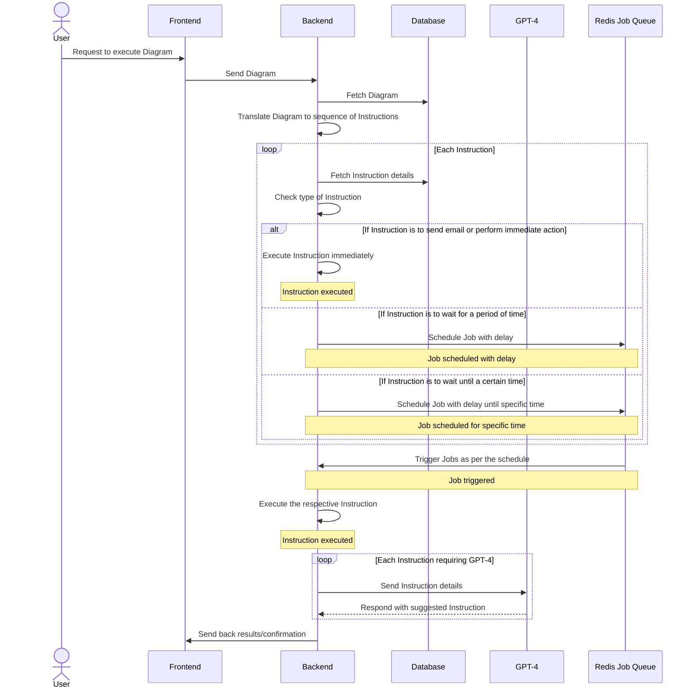

## Designing an Instruction Table for Comprehensive Email Marketing

For an email marketing process, there could be multiple elements that we need to keep track of and handle. Here's an example of how an `Instructions` table might look:

| instruction_id | action                          | parameters                               | description                                                                         |
|----------------|---------------------------------|------------------------------------------|-------------------------------------------------------------------------------------|
| 1              | ComposeEmail                    | subject, body, templateId                | Composes an email with a given subject, body and based on a specific template.       |
| 2              | ScheduleEmail                   | sendTime                                 | Schedules the email to be sent at a specified time.                                  |
| 3              | SendEmailNow                    | None                                     | Immediately sends the composed email.                                               |
| 4              | CheckEmailOpen                  | None                                     | Checks if the email has been opened by the recipient.                                |
| 5              | WaitPeriod                      | waitTime                                 | Waits for a specified period of time.                                               |
| 6              | ComposeFollowUpEmail            | subject, body, templateId                | Composes a follow-up email with a given subject, body and based on a specific template. |
| 7              | SendFollowUpEmail               | None                                     | Sends the composed follow-up email.                                                 |
| 8              | CheckFollowUpEmailOpen          | None                                     | Checks if the follow-up email has been opened by the recipient.                      |
| 9              | ComposeSMS                      | message, templateId                      | Composes a SMS with a given message and based on a specific template.               |
| 10             | ScheduleSMS                     | sendTime                                 | Schedules the SMS to be sent at a specified time.                                   |
| 11             | SendSMSNow                      | None                                     | Immediately sends the composed SMS.                                                 |
| 12             | ComposeNotification             | message, templateId                      | Composes a notification with a given message and based on a specific template.      |
| 13             | ScheduleNotification            | sendTime                                 | Schedules the notification to be sent at a specified time.                          |
| 14             | SendNotificationNow             | None                                     | Immediately sends the composed notification.                                        |
| 15             | ComposeWebPush                  | title, message, icon, link               | Composes a web push notification with the specified title, message, icon, and link.  |
| 16             | ScheduleWebPush                 | sendTime                                 | Schedules the web push notification to be sent at a specified time.                 |
| 17             | SendWebPushNow                  | None                                     | Immediately sends the composed web push notification.                               |
| 18             | TrackEmailClick                 | None                                     | Tracks whether an email has been clicked by the recipient.                          |
| 19             | TrackSMSClick                   | None                                     | Tracks whether an SMS has been clicked by the recipient.                            |
| 20             | TrackNotificationClick          | None                                     | Tracks whether a notification has been clicked by the recipient.                    |
| 21             | TrackWebPushClick               | None                                     | Tracks whether a web push notification has been clicked by the recipient.           |
| 22             | CreateEmailList                 | listName                                 | Creates a new email list with the specified name.                                   |
| 23             | AddToEmailList                  | email, listName                          | Adds a specified email to a specified email list.                                   |
| 24             | RemoveFromEmailList             | email, listName                          | Removes a specified email from a specified email list.                              |
| 25             | ImportEmailList                 | listName, fileLocation                   | Imports an email list from a specified file location to a specified email list.     |
| 26             | ExportEmailList                 | listName, fileLocation                   | Exports a specified email list to a specified file location.                        |
| 27             | UpdateEmailTemplate             | templateId, subject, body                | Updates a specified email template with a new subject and body.                     |
| 28             | CreateEmailTemplate             | templateName, subject, body              | Creates a new email template with a specified name, subject, and body.              |
| 29             | DeleteEmailTemplate             | templateId                               | Deletes a specified email template.                                                 |
| 30             | SendABTestEmail                 | templateIdA, templateIdB, listName       | Sends an A/B test email to a specified list using two different email templates.    |
| 31             | CreateUserSegment             | segmentName, conditions                 | Creates a new user segment based on specific conditions (e.g., location, behavior). |
| 32             | UpdateUserSegment             | segmentId, conditions                   | Updates an existing user segment with new conditions.                               |
| 33             | DeleteUserSegment             | segmentId                               | Deletes a specified user segment.                                                   |
| 34             | GenerateReport                | reportType, startDate, endDate          | Generates a report of a specific type for a defined period.                         |
| 35             | ScheduleReport                | reportType, startDate, endDate, sendTime| Schedules a report to be sent at a specific time.                                   |
| 36             | ComposeTweet                  | tweetContent                            | Composes a tweet with the given content.                                            |
| 37             | ScheduleTweet                 | sendTime                                | Schedules the tweet to be sent at a specific time.                                  |
| 38             | PostTweetNow                  | None                                    | Immediately posts the composed tweet.                                               |
| 39             | TrackTweetEngagement          | None                                    | Tracks engagement metrics (like, retweet, reply) on a tweet.                        |
| 40             | ComposeFacebookPost           | postContent                             | Composes a Facebook post with the given content.                                    |
| 41             | ScheduleFacebookPost          | sendTime                                | Schedules the Facebook post to be sent at a specific time.                          |
| 42             | PostFacebookNow               | None                                    | Immediately posts the composed Facebook post.                                       |
| 43             | TrackFacebookEngagement       | None                                    | Tracks engagement metrics (likes, shares, comments) on a Facebook post.             |
| 44             | ComposeLinkedInPost           | postContent                             | Composes a LinkedIn post with the given content.                                    |
| 45             | ScheduleLinkedInPost          | sendTime                                | Schedules the LinkedIn post to be sent at a specific time.                          |
| 46             | PostLinkedInNow               | None                                    | Immediately posts the composed LinkedIn post.                                       |
| 47             | TrackLinkedInEngagement       | None                                    | Tracks engagement metrics (likes, shares, comments) on a LinkedIn post.             |
| 48             | CreateABTest                | testName, variationA, variationB     | Creates a new A/B test with two variations.                                        |
| 49             | StartABTest                 | testId                               | Starts the specified A/B test.                                                      |
| 50             | EndABTest                   | testId                               | Ends the specified A/B test.                                                        |
| 51             | GetABTestResults            | testId                               | Retrieves the results of the specified A/B test.                                    |
| 52             | GenerateAnalyticsReport     | startDate, endDate, metrics          | Generates an analytics report for a specified period based on provided metrics.     |
| 53             | AddRSSFeed                  | feedURL, sendTime                    | Adds an RSS Feed and schedules emails to send updates at a specified time.          |
| 54             | RemoveRSSFeed               | feedId                               | Removes the specified RSS Feed.                                                     |
| 55             | CreateSurvey                | surveyQuestions, sendTime            | Creates a survey with specified questions and schedules a send time.                |
| 56             | SendSurvey                  | surveyId                             | Sends the specified survey immediately.                                             |
| 57             | GetSurveyResults            | surveyId                             | Retrieves the results of the specified survey.                                      |
| 58             | ScheduleWebinar             | webinarDetails, sendTime             | Schedules a webinar with specified details and schedules a send time.               |
| 59             | SendWebinarInvite           | webinarId                            | Sends invitations for the specified webinar immediately.                            |
| 60             | GetWebinarAttendance        | webinarId                            | Retrieves attendance details for the specified webinar.                             |
| 61             | LinkSocialMedia             | platform, accountId                         | Links a social media account to the email campaign.                                 |
| 62             | ShareEmailCampaign          | campaignId, platform                        | Shares an email campaign on the linked social media platform.                       |
| 63             | SendTransactionalEmail      | templateId, recipient, data                 | Sends a transactional email based on a template, recipient and data.                |
| 64             | PersonalizeContent          | campaignId, personalizationFields           | Personalizes the content of a campaign based on specific fields.                    |
| 65             | CreateSegment               | segmentName, criteria                       | Creates a new customer segment based on specific criteria.                          |
| 66             | AddToSegment                | segmentId, customerId                       | Adds a customer to a specific segment.                                             |
| 67             | RemoveFromSegment           | segmentId, customerId                       | Removes a customer from a specific segment.                                        |
| 68             | SendToSegment               | campaignId, segmentId                       | Sends a specific campaign to a specific customer segment.                           |
| 69             | GetSegmentPerformance       | segmentId                                   | Retrieves performance details for a specific segment.                           
| 70             | TrackEmailOpens                      | campaignId                                  | Tracks the number of opens for a specific email campaign.                              |
| 71             | TrackEmailClicks                     | campaignId                                  | Tracks the number of clicks within a specific email campaign.                          |
| 72             | GetCampaignAnalytics                 | campaignId                                  | Retrieves detailed analytics for a specific campaign.                                  |
| 73             | CreateABTest                         | campaignIdA, campaignIdB, successMetric     | Creates an A/B test with two campaigns and a success metric to compare.               |
| 74             | GetABTestResults                     | testId                                      | Retrieves the results of a specific A/B test.                                          |
| 75             | ApplyABTestResults                   | testId                                      | Applies the results of a specific A/B test to future campaigns.                        |
| 76             | SyncWithCRM                          | CRMPlatform, CRMAccountId                   | Synchronizes the email marketing system with a CRM platform.                           |
| 77             | UpdateCRMRecord                      | CRMPlatform, recordId, data                 | Updates a specific record in the linked CRM platform with new data.                    |
| 78             | GetCRMRecord                         | CRMPlatform, recordId                       | Retrieves a specific record from the linked CRM platform.                              |
| 79             | SendEmailCampaignFromCRM             | CRMPlatform, campaignTemplateId, recipient  | Sends an email campaign to a recipient as specified in the linked CRM platform.        |
| 80             | CreateAudienceSegment                | audienceCriteria                 | Creates an audience segment based on certain criteria.                        |
| 81             | GetAudienceSegment                   | segmentId                        | Retrieves a specific audience segment.                                        |
| 82             | SendEmailToAudienceSegment           | segmentId, campaignId            | Sends a specific email campaign to a specific audience segment.               |
| 83             | CreateBehavioralTrigger              | triggerCriteria                  | Creates a behavioral trigger based on certain user actions.                   |
| 84             | TriggerEmailByBehavior               | triggerId, campaignId            | Triggers a specific email campaign when a certain user behavior occurs.       |
| 85             | CreatePersonalizationTag             | tagName, tagValueCriteria        | Creates a personalization tag based on certain user data criteria.            |
| 86             | SendPersonalizedEmail                | tagId, campaignId                | Sends a specific email campaign with personalized content based on a tag.     |
| 87             | AnalyzeCampaignEffectiveness         | campaignId, metricCriteria       | Analyzes the effectiveness of a campaign based on certain success metrics.    |
| 88             | OptimizeSendTimes                    | campaignId                       | Optimizes the send times of a campaign based on recipient engagement data.    |
| 89             | GenerateCampaignPerformanceReport    | campaignId                       | Generates a detailed performance report for a specific campaign.              |
| 90             | CreateABTest                         | campaignIdA, campaignIdB            | Creates an A/B test between two email campaigns.                                |
| 91             | AnalyzeABTestResults                 | testId                              | Analyzes the results of a specific A/B test.                                    |
| 92             | SelectWinningCampaign                | testId                              | Selects the winning email campaign based on the results of an A/B test.         |
| 93             | CreateLandingPage                    | pageDetails                         | Creates a landing page with specific details (content, layout, etc.).           |
| 94             | LinkEmailToLandingPage               | campaignId, landingPageId           | Links a specific email campaign to a landing page.                              |
| 95             | TrackUserActionsOnLandingPage        | landingPageId                       | Tracks user actions (clicks, form submissions, etc.) on a specific landing page.|
| 96             | CreateExitIntentPopUp                | popUpDetails                        | Creates an exit intent pop-up for a landing page.                               |
| 97             | LinkPopUpToEmailCampaign             | campaignId, exitIntentPopUpId       | Links a specific email campaign to an exit intent pop-up.                       |
| 98             | TrackPopUpEngagement                 | exitIntentPopUpId                   | Tracks user engagement with a specific exit intent pop-up.                      |
| 99             | GenerateLandingPagePerformanceReport | landingPageId                  | Generates a detailed performance report for a specific landing page.            |
| 100            | GenerateUserEngagementReport         | campaignId                               | Generates a report on user engagement with a specific email campaign.                  |
| 101            | GenerateOverallCampaignReport        |                                          | Generates a comprehensive report on all email campaigns.                               |
| 102            | IdentifyHighlyEngagedUsers           | campaignId                               | Identifies users who are highly engaged with a specific email campaign.                |
| 103            | PersonalizeEmail                     | campaignId, personalizationDetails       | Personalizes an email campaign based on specific user details (location, past behavior, etc.) |
| 104            | CreateSegment                        | segmentCriteria                          | Creates a user segment based on specified criteria.                                   |
| 105            | SendEmailToSegment                   | campaignId, segmentId                    | Sends an email campaign to a specific user segment.                                   |
| 106            | CreateDripCampaign                   | campaignDetails                          | Creates a drip email campaign (a series of emails sent out automatically on a schedule). |
| 107            | StartDripCampaign                    | campaignId                               | Starts sending emails as part of a drip campaign.                                     |
| 108            | PauseDripCampaign                    | campaignId                               | Pauses a drip campaign.                                                               |
| 109            | ResumeDripCampaign                   | campaignId                               | Resumes a paused drip campaign.                                                        |
| 110            | CreateEmailTemplate                  | templateDetails                          | Creates a new email template with the provided details.                                |
| 111            | UpdateEmailTemplate                  | templateId, updatedDetails               | Updates an existing email template with the new details.                               |
| 112            | DeleteEmailTemplate                  | templateId                               | Deletes a specified email template.                                                    |
| 113            | CreateABTest                         | testDetails                              | Creates a new A/B test with the provided details.                                     |
| 114            | StartABTest                          | testId                                   | Starts the specified A/B test.                                                        |
| 115            | AnalyzeABTestResults                 | testId                                   | Generates a report on the results of a specific A/B test.                             |
| 116            | IdentifyInactiveUsers                | daysInactive                             | Identifies users who have been inactive for a specified number of days.                |
| 117            | CreateRetentionCampaign              | campaignDetails                          | Creates a new email campaign aimed at re-engaging inactive users.                     |
| 118            | StartRetentionCampaign               | campaignId                               | Starts the specified user retention email campaign.                                   |
| 119            | AnalyzeRetentionCampaignResults      | campaignId                               | Generates a report on the results of a specific user retention campaign.              |

## Implementing Custom Actions Using Redis Job Queue

Let's implement the two actions from your table: ComposeEmail and WaitPeriod. 

Firstly, you would create separate JavaScript files for each action. 

In `ComposeEmail.js`:

```javascript
const nodemailer = require("nodemailer");

const composeEmail = async (parameters) => {
    const { subject, body, templateId } = parameters;

    // get template based on templateId
    // assuming getTemplate is a function that gets email template based on templateId
    const template = await getTemplate(templateId);

    // Compose email
    const emailContent = template.replace("{{subject}}", subject).replace("{{body}}", body);

    // Assuming we have a mail transport setup
    const transporter = nodemailer.createTransport({
        service: "gmail",
        auth: {
            user: "your-email@gmail.com",
            pass: "your-password"
        }
    });

    // Email options
    let mailOptions = {
        from: 'your-email@gmail.com',
        to: 'recipient-email@gmail.com',
        subject: subject,
        html: emailContent
    };

    // Sending email
    let info = await transporter.sendMail(mailOptions);

    console.log("Message sent: %s", info.messageId);
}

module.exports = composeEmail;
```

In `WaitPeriod.js`:

```javascript
const waitPeriod = async (parameters) => {
    const { waitTime } = parameters; // in milliseconds

    return new Promise((resolve) => {
        setTimeout(resolve, waitTime);
    });
}

module.exports = waitPeriod;
```

Then, you could modify the executeInstruction function to use these files based on the instruction type.

```javascript
const ComposeEmail = require('./ComposeEmail');
const WaitPeriod = require('./WaitPeriod');

async function executeInstruction(instruction) {
    const { action, parameters } = instruction;

    switch(action) {
        case 'ComposeEmail':
            return await ComposeEmail(parameters);
        case 'WaitPeriod':
            return await WaitPeriod(parameters);
        default:
            console.error(`Unknown instruction action: ${action}`);
    }
}
```

We are using [node-mailer](https://nodemailer.com/about/) for sending the emails in this example. Please replace `'your-email@gmail.com'` and `'recipient-email@gmail.com'` with valid email addresses. Also, use the valid `auth` credentials.

For the WaitPeriod action, we're simply using JavaScript's built-in `setTimeout` function. This will halt the execution for the specified amount of time.

Please note that the `getTemplate` function is not defined. This would be your function to fetch email templates. You would need to create this function based on your own email templates' storage and retrieval mechanisms.

For the Redis queue, when the WaitPeriod instruction is encountered, rather than waiting in the current function execution, we add a delayed job to the Redis queue with the rest of the instructions to be performed after the wait. This way, the system can continue executing other tasks and come back to this diagram's instructions once the wait period is over. Please note that this would require a library or framework that supports delayed jobs in Redis queues.

To implement more instructions, you would create more files like `ComposeEmail.js` and `WaitPeriod.js` and add more cases to the switch statement in `executeInstruction`.

Here's a simplified diagram:



For more detailed implementation, you would need to consider the architecture of your own system and adapt accordingly.

## Implementing Centralized Instruction Execution Route in Express.js

Here's an example of a centralized route that executes the appropriate function based on the instruction. For this example, I'll use Express.js for routing, and I'll assume that the logic for each instruction is defined in a separate function stored in an object called `instructionFunctions`.

```javascript
// Express setup
const express = require('express');
const app = express();
app.use(express.json());

// An object mapping instruction names to their respective functions
const instructionFunctions = {
  ComposeEmail: composeEmail,
  ScheduleEmail: scheduleEmail,
  SendEmailNow: sendEmailNow,
  CheckEmailOpen: checkEmailOpen,
  WaitPeriod: waitPeriod,
  CheckFollowUpEmailOpen: checkFollowUpEmailOpen,
  ComposeSMS: composeSMS
  // Add more instruction functions as needed
};

app.post('/executeInstruction', async (req, res) => {
  const { instructionId, parameters } = req.body;

  // Fetch the instruction details from the database
  // This could be replaced with a real database query
  const instruction = await getInstructionFromDB(instructionId);

  if (!instruction) {
    res.status(404).json({ error: 'Instruction not found' });
    return;
  }

  const instructionFunction = instructionFunctions[instruction.action];
  
  if (!instructionFunction) {
    res.status(400).json({ error: 'Invalid instruction action' });
    return;
  }

  try {
    const result = await instructionFunction(parameters);
    res.json(result);
  } catch (err) {
    res.status(500).json({ error: 'Error executing instruction' });
  }
});

app.listen(3000, () => {
  console.log('Server is running on port 3000');
});
```

In this example, the `/executeInstruction` route receives a POST request containing an `instructionId` and `parameters`. It fetches the corresponding instruction from the database using the `getInstructionFromDB` function (which you'd need to implement), and then it finds the appropriate function to execute using the `instructionFunctions` object. If it can't find the instruction or the appropriate function, it sends an error response. Otherwise, it executes the instruction function and sends the result back in the response.

This is a relatively simple example, and you'd likely need to add more complexity for a real-world application, such as error checking, logging, authentication, and more.

## classes vs functions vs objects

The best approach to organize the instructions depends on the complexity of your application and personal or team preferences. Here are some things to consider for each approach:

1. **Separate function per file**: This approach can be beneficial if each function has substantial complexity and requires its own set of dependencies. It can help in isolating concerns and making the code easier to understand. However, if you have many simple functions, this approach can lead to a lot of small files, which can make the project harder to navigate.

2. **All functions in a class**: If your instructions have shared state or need to access the same set of services or dependencies, a class could be a good fit. The class can take these shared dependencies as constructor arguments, and each method can work with them. This also allows you to leverage object-oriented principles like encapsulation and inheritance. However, this can also lead to large classes that are difficult to manage if not carefully designed.

3. **Store them in an object**: If your instructions are stateless and don't have shared dependencies, storing them in an object can be a simple and effective approach. It's easy to iterate over an object to find the function you need to call and it allows for a degree of dynamic dispatch based on the instruction name. However, this can be less structured and harder to manage for complex applications compared to classes or separate files.

A good rule of thumb is to start simple and refactor as your needs become more complex. Starting with an object or simple class and then refactoring into separate files or a more complex class structure as your project grows is a common strategy.

### classes

Here is a table with the instructions grouped by their recommended structure:

| Recommended Structure | instruction_id | action                          | parameters                               | description                                                                         |
|-----------------------|----------------|---------------------------------|------------------------------------------|-------------------------------------------------------------------------------------|
| Class `EmailHandler`  | 1              | ComposeEmail                    | subject, body, templateId                | Composes an email with a given subject, body and based on a specific template.       |
|                       | 2              | ScheduleEmail                   | sendTime                                 | Schedules the email to be sent at a specified time.                                  |
|                       | 3              | SendEmailNow                    | None                                     | Immediately sends the composed email.                                               |
|                       | 4              | CheckEmailOpen                  | None                                     | Checks if the email has been opened by the recipient.                                |
|                       | 6              | ComposeFollowUpEmail            | subject, body, templateId                | Composes a follow-up email with a given subject, body and based on a specific template. |
|                       | 7              | SendFollowUpEmail               | None                                     | Sends the composed follow-up email.                                                 |
|                       | 8              | CheckFollowUpEmailOpen          | None                                     | Checks if the follow-up email has been opened by the recipient.                      |
|                       | 18             | TrackEmailClick                 | None                                     | Tracks whether an email has been clicked by the recipient.                          |
|                       | 22             | CreateEmailList                 | listName                                 | Creates a new email list with the specified name.                                   |
|                       | 23             | AddToEmailList                  | email, listName                          | Adds a specified email to a specified email list.                                   |
|                       | 24             | RemoveFromEmailList             | email, listName                          | Removes a specified email from a specified email list.                              |
|                       | 25             | ImportEmailList                 | listName, fileLocation                   | Imports an email list from a specified file location to a specified email list.     |
|                       | 26             | ExportEmailList                 | listName, fileLocation                   | Exports a specified email list to a specified file location.                        |
|                       | 27             | UpdateEmailTemplate             | templateId, subject, body                | Updates a specified email template with a new subject and body.                     |
|                       | 28             | CreateEmailTemplate             | templateName, subject, body              | Creates a new email template with a specified name, subject, and body.              |
|                       | 29             | DeleteEmailTemplate             | templateId                               | Deletes a specified email template.                                                 |
|                       | 30             | SendABTestEmail                 | templateIdA, templateIdB, listName       | Sends an A/B test email to a specified list using two different email templates.    |
|                       | 63             | SendTransactionalEmail          | templateId, recipient, data              | Sends a transactional email based on a template, recipient and data.                |
|                       | 64             | PersonalizeContent              | campaignId, personalizationFields        | Personalizes the content of a campaign based on specific fields.                    |
|                       | 70             | TrackEmailOpens                 | campaignId                               | Tracks the number of opens for a specific email campaign.                           |
|                       | 71             | TrackEmailClicks                | campaignId                               | Tracks the number of clicks within a specific email campaign.                       |
|                       | 72             | GetCampaignAnalytics            | campaignId                               | Retrieves detailed analytics for a specific campaign.                               |
|                       | 73             | CreateABTest                    | campaignIdA, campaignIdB, successMetric  | Creates an A/B test with two campaigns and a success metric to compare.            |
|                       | 74             | GetABTestResults                | testId                                   | Retrieves the results of a specific A/B test.                                       |
|                       | 75             | ApplyABTestResults              | testId                                   | Applies the results of a specific A/B test to future campaigns.                     |
|                       | 79             | SendEmailCampaignFromCRM        | CRMPlatform, campaignTemplateId, recipient| Sends an email campaign to a recipient as specified in the linked CRM platform.     |
| Class `SMSSender`     | 9              | ComposeSMS                      | message, templateId                      | Composes a SMS with a given message and based on a specific template.               |
|                       | 10             | ScheduleSMS                     | sendTime                                 | Schedules the SMS to be sent at a specified time.                                   |
|                       | 11             | SendSMSNow                      | None                                     | Immediately sends the composed SMS.                                                 |
|                       | 19             | TrackSMSClick                   | None                                     | Tracks whether an SMS has been clicked by the recipient.                            |
| Class `NotificationManager` | 12         | ComposeNotification             | message, templateId                      | Composes a notification with a given message and based on a specific template.      |
|                       | 13             | ScheduleNotification            | sendTime                                 | Schedules the notification to be sent at a specified time.                          |
|                       | 14             | SendNotificationNow             | None                                     | Immediately sends the composed notification.                                        |
|                       | 20             | TrackNotificationClick          | None                                     | Tracks whether a notification has been clicked by the recipient.                    |
| Class `WebPushManager`| 15             | ComposeWebPush                  | title, message, icon, link               | Composes a web push notification with the specified title, message, icon, and link. |
|                       | 16             | ScheduleWebPush                 | sendTime                                 | Schedules the web push notification to be sent at a specified time.                 |
|                       | 17             | SendWebPushNow                  | None                                     | Immediately sends the composed web push notification.                               |
|                       | 21             | TrackWebPushClick               | None                                     | Tracks whether a web push notification has been clicked by the recipient.           |
| Class `SegmentManager`| 31             | CreateUserSegment               | segmentName, conditions                  | Creates a new user segment based on specific conditions (e.g., location, behavior).|
|                       | 32             | UpdateUserSegment               | segmentId, conditions                    | Updates an existing user segment with new conditions.                               |
|                       | 33             | DeleteUserSegment               | segmentId                                | Deletes a specified user segment.                                                   |
|                       | 65             | CreateSegment                   | segmentName, criteria                    | Creates a new customer segment based on specific criteria.                          |
|                       | 66             | AddToSegment                    | segmentId, customerId                    | Adds a customer to a specific segment.                                             |
|                       | 67             | RemoveFromSegment               | segmentId, customerId                    | Removes a customer from a specific segment.                                        |
|                       | 68             | SendToSegment                   | campaignId, segmentId                    | Sends a specific campaign to a specific customer segment.                           |
|                       | 69             | GetSegmentPerformance           | segmentId                                | Retrieves performance details for a specific segment.                              |
| Class `ReportGenerator`| 34            | GenerateReport                  | reportType, startDate, endDate           | Generates a report of a specific type for a defined period.                         |
| Class `ReportGenerator`| 35            | ScheduleReport                  | reportType, startDate, endDate, schedule | Schedules a report of a specific type for a defined period and frequency.            |
|                       | 36            | CancelScheduledReport           | scheduleId                              | Cancels a scheduled report by its ID.                                               |
|                       | 76             | GenerateCampaignReport          | campaignId                              | Generates a detailed report for a specific campaign.                                |
|                       | 77             | ScheduleCampaignReport          | campaignId, schedule                    | Schedules a detailed report for a specific campaign at regular intervals.           |
|                       | 78             | CancelScheduledCampaignReport   | scheduleId                              | Cancels a scheduled campaign report by its ID.                                      |
| Class `CRMIntegration`| 37             | SyncWithCRM                     | CRMPlatform, data                       | Syncs data with a specified Customer Relationship Management (CRM) platform.         |
|                       | 38             | UpdateCRMData                   | CRMPlatform, data                       | Updates the CRM data in the specified platform with the given data.                 |
|                       | 39             | GetCRMData                      | CRMPlatform, dataRequest                | Retrieves specific data from the CRM platform.                                      |
|                       | 40             | SendCRMCampaign                 | CRMPlatform, campaignId                 | Sends a campaign via the CRM platform.                                              |
| Class `SocialMediaManager`| 41         | CreateSocialPost                | platform, message, mediaUrl             | Creates a social media post for the specified platform with given message and media.|
|                       | 42             | ScheduleSocialPost              | platform, sendTime                      | Schedules a social media post for a specified time on the platform.                 |
|                       | 43             | PostNow                         | platform                                | Posts the created content immediately on the specified platform.                    |
|                       | 44             | UpdateSocialPost                | platform, postId, newMessage, newMedia  | Updates a social post on a specified platform with new content.                     |
|                       | 45             | DeleteSocialPost                | platform, postId                        | Deletes a specified post from a specific social media platform.                     |
|                       | 46             | TrackPostEngagement             | platform, postId                        | Tracks the engagement (likes, shares, comments) of a post on a specific platform.   |
| Class `AdsManager`    | 47             | CreateAdCampaign                | platform, budget, targetAudience, adContent | Creates an ad campaign on a specific platform with budget, target audience, and content. |
|                       | 48             | LaunchAdCampaign                | platform, campaignId                   | Launches a created ad campaign on the specified platform.                           |
|                       | 49             | UpdateAdCampaign                | platform, campaignId, newBudget, newTarget, newContent | Updates an ad campaign on a specific platform with new parameters.                  |
|                       | 50             | PauseAdCampaign                 | platform, campaignId                   | Pauses an active ad campaign on a specific platform.                                |
|                       | 51             | ResumeAdCampaign                | platform, campaignId                   | Resumes a paused ad campaign on a specific platform.                                |
|                       | 52             | StopAdCampaign                  | platform, campaignId                   | Stops an ad campaign on a specific platform.                                        |
|                       | 53             | TrackAdPerformance              | platform, campaignId                   | Tracks the performance (impressions, clicks, conversions) of an ad campaign.        |
| Class `AnalyticsManager`| 54           | TrackUserBehavior               | userId, behaviorData                    | Tracks a user's behavior with the given data.                                       |
|                       | 55             | GetUserBehavior                 | userId                                  | Retrieves a user's tracked behavior.                                                |
|                       | 56             | AnalyzeBehavior                 | userId, behaviorType                    | Analyzes a specific type of behavior for a user.                                    |
|                       | 57             | GenerateBehaviorReport          | userId, startDate, endDate              | Generates a behavior report for a user for a specific period.                       |
|                       | 58             | ScheduleBehaviorReport          | userId, startDate, endDate, schedule    | Schedules a behavior report for a user for a defined period and frequency.          |
|                       | 59             | CancelScheduledBehaviorReport   | scheduleId                              | Cancels a scheduled behavior report by its ID.                                      |
|                       | 60             | GetCampaignAnalytics            | campaignId                              | Retrieves the analytics for a specific campaign.                                    |
|                       | 61             | GetAdAnalytics                  | adId                                    | Retrieves the analytics for a specific ad.                                          |
|                       | 62             | GetSocialPostAnalytics          | postId                                  | Retrieves the analytics for a specific social post.                                 |
|                       | 63             | GetEmailAnalytics               | emailId                                 | Retrieves the analytics for a specific email.                                       |
|                       | 64             | GetSMSAnalytics                 | smsId                                   | Retrieves the analytics for a specific SMS.                                         |
| Recommended Structure | instruction_id | action                          | parameters                               | description                                                                         |
|-----------------------|----------------|---------------------------------|------------------------------------------|-------------------------------------------------------------------------------------|
| Class `AudienceManager`| 80            | CreateAudienceSegment           | audienceCriteria                        | Creates an audience segment based on certain criteria.                              |
|                       | 81             | GetAudienceSegment              | segmentId                               | Retrieves a specific audience segment.                                              |
|                       | 82             | SendEmailToAudienceSegment      | segmentId, campaignId                   | Sends a specific email campaign to a specific audience segment.                     |
| Class `TriggerManager`| 83             | CreateBehavioralTrigger         | triggerCriteria                         | Creates a behavioral trigger based on certain user actions.                         |
|                       | 84             | TriggerEmailByBehavior          | triggerId, campaignId                   | Triggers a specific email campaign when a certain user behavior occurs.             |
| Class `PersonalizationManager`| 85      | CreatePersonalizationTag        | tagName, tagValueCriteria               | Creates a personalization tag based on certain user data criteria.                  |
|                       | 86             | SendPersonalizedEmail           | tagId, campaignId                       | Sends a specific email campaign with personalized content based on a tag.           |
| Class `CampaignAnalyzer`| 87           | AnalyzeCampaignEffectiveness    | campaignId, metricCriteria              | Analyzes the effectiveness of a campaign based on certain success metrics.          |
|                       | 88             | OptimizeSendTimes               | campaignId                              | Optimizes the send times of a campaign based on recipient engagement data.          |
|                       | 89             | GenerateCampaignPerformanceReport| campaignId                             | Generates a detailed performance report for a specific campaign.                    |
| Class `TestManager`   | 90             | CreateABTest                    | campaignIdA, campaignIdB                | Creates an A/B test between two email campaigns.                                    |
|                       | 91             | AnalyzeABTestResults            | testId                                  | Analyzes the results of a specific A/B test.                                        |
|                       | 92             | SelectWinningCampaign           | testId                                  | Selects the winning email campaign based on the results of an A/B test.             |
| Class `PageManager`   | 93             | CreateLandingPage               | pageDetails                             | Creates a landing page with specific details (content, layout, etc.).               |
|                       | 94             | LinkEmailToLandingPage          | campaignId, landingPageId               | Links a specific email campaign to a landing page.                                  |
|                       | 95             | TrackUserActionsOnLandingPage   | landingPageId                           | Tracks user actions (clicks, form submissions, etc.) on a specific landing page.    |
| Class `PopUpManager`  | 96             | CreateExitIntentPopUp           | popUpDetails                            | Creates an exit intent pop-up for a landing page.                                   |
|                       | 97             | LinkPopUpToEmailCampaign        | campaignId, exitIntentPopUpId           | Links a specific email campaign to an exit intent pop-up.                           |
|                       | 98             | TrackPopUpEngagement            | exitIntentPopUpId                       | Tracks user engagement with a specific exit intent pop-up.                          |
| Class `ReportGenerator`| 99            | GenerateLandingPagePerformanceReport| landingPageId                        | Generates a detailed performance report for a specific landing page.                |
|                       | 100            | GenerateUserEngagementReport    | campaignId                              | Generates a report on user engagement with a specific email campaign.               |
|                       |
 101            | GenerateOverallCampaignReport   |                                          | Generates a comprehensive report on all email campaigns.                            |
| Class `EngagementManager`| 102         | IdentifyHighlyEngagedUsers      | campaignId                              | Identifies users who are highly engaged with a specific email campaign.             |
| Class `PersonalizationManager`| 103    | PersonalizeEmail                | campaignId, personalizationDetails      | Personalizes an email campaign based on specific user details (location, past behavior, etc.)|
| Class `AudienceManager`| 104           | CreateSegment                   | segmentCriteria                         | Creates a user segment based on specified criteria.                                 |
|                       | 105            | SendEmailToSegment              | campaignId, segmentId                   | Sends an email campaign to a specific user segment.                                 |
| Class `CampaignManager`| 106           | CreateDripCampaign              | campaignDetails                         | Creates a drip email campaign (a series of emails sent out automatically on a schedule). |
|                       | 107            | StartDripCampaign               | campaignId                              | Starts sending emails as part of a drip campaign.                                   |
|                       | 108            | PauseDripCampaign               | campaignId                              | Pauses a drip campaign.                                                             |
|                       | 109            | ResumeDripCampaign              | campaignId                              | Resumes a paused drip campaign.                                                     |
| Class `TemplateManager`| 110           | CreateEmailTemplate             | templateDetails                         | Creates a new email template with the provided details.                             |
|                       | 111            | UpdateEmailTemplate             | templateId, updatedDetails              | Updates an existing email template with the new details.                            |
|                       | 112            | DeleteEmailTemplate             | templateId                              | Deletes a specified email template.                                                 |
| Class `TestManager`   | 113            | CreateABTest                    | testDetails                             | Creates a new A/B test with the provided details.                                   |
|                       | 114            | StartABTest                     | testId                                  | Starts the specified A/B test.                                                      |
|                       | 115            | AnalyzeABTestResults            | testId                                  | Generates a report on the results of a specific A/B test.                           |
| Class `UserActivityManager`| 116       | IdentifyInactiveUsers           | daysInactive                            | Identifies users who have been inactive for a specified number of days.             |
| Class `RetentionManager`| 117          | CreateRetentionCampaign         | campaignDetails                         | Creates a new email campaign aimed at re-engaging inactive users.                   |
|                       | 118            | StartRetentionCampaign          | campaignId                              | Starts the specified user retention email campaign.                                 |
|                       | 119            | AnalyzeRetentionCampaignResults | campaignId                              | Generates a report on the results of a specific user retention campaign.            |un