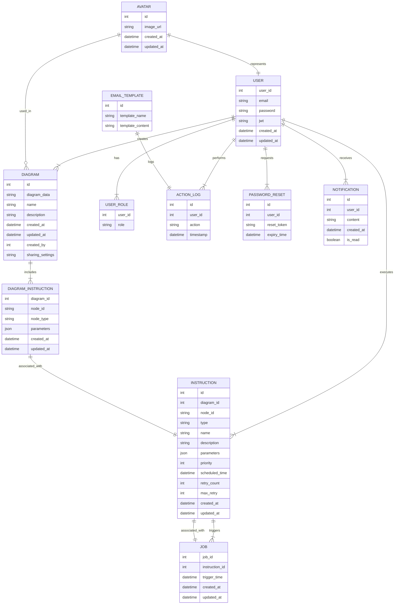

# Entity-Relationship (ER) Diagram based on the Sequence Diagram


**Introduction**

Expanding the tables to their full potential would involve considering typical attributes that might be included in these types of tables. This includes information such as timestamps for record creation and updates, foreign keys to connect related entities, and additional columns to store data relevant to the application's use case.

**Mermaid ER Diagram**


**Entities (Tables) Description**

1. `User`: This entity represents the users of the system. The attributes include `user_id`, `email`, `password`, `jwt` (JSON Web Token for authentication), `created_at`, and `updated_at`.

2. `Diagram`: This entity represents the diagrams created by users. It has attributes like `id`, `diagram_data`, `name`, `description`, `created_at`, `updated_at`, and `created_by`.

3. `Instruction`: This entity stores the instructions associated with each diagram. The attributes include `id`, `diagram_id`, `node_id`, `type`, `name`, `description`, `parameters`, `priority`, `scheduled_time`, `retry_count`, `max_retry`, `created_at`, and `updated_at`.

4. `Job`: This entity represents the jobs created for delayed or scheduled instructions. It has a `job_id`, an `instruction_id` to link the job to a specific instruction, a `trigger_time` which indicates when the job should be executed, and timestamps `created_at` and `updated_at`.

5. `Diagram_Instruction`: This junction table that represents the many-to-many relationship between the `Diagram` and `Instruction` tables. It contains `diagram_id`, `node_id`, `node_type`, and `parameters` as attributes, as well as `created_at` and `updated_at`.

Please note that this is a simplified ER diagram based on the sequence diagram and the tables you provided. Depending on the complexity and requirements of your actual system, you might need to add more entities, relationships, or attributes.

**Introduction**

The proposed database schema appears to cover the required functionalities and operations described in the sequence diagram. However, a few additional points could be considered.

1. **Mind Map Sharing:** In the sequence diagram, the user has the ability to share the mind map. This would involve having permissions and shared settings saved somewhere. We might need a table (e.g., `Shared_Mindmaps`) to keep track of these sharing permissions.

2. **Avatar:** The Avatar generated by the GPT-4 needs to be stored somewhere. This could be in the `User` table or in a separate `Avatar` table.

3. **Immediate Actions:** If immediate actions are to be executed and their outcomes tracked, a table to log these immediate actions could be useful.

4. **Users and JWTs:** Consideration on how to handle JWTs might be required. If they are to be invalidated or refreshed, a table may be required to handle this.

So, while the ER diagram mostly covers the actions represented in the sequence diagram, there are a few additional considerations based on the specific requirements of your application.

Here's an updated ER diagram including the above points:

**Mermaid ER Diagram**


[dbdiagram link](https://dbdiagram.io/d/6487e789722eb77494da0e29)

<iframe width="700" height="800" src='https://dbdiagram.io/embed/6487e789722eb77494da0e29' frameBorder="0"> </iframe>

The `Avatar` table has been added, which includes a foreign key to the `User` table. The `Shared_Mindmaps` table has been added to handle sharing of mind maps between users. Each record in this table represents a specific mind map shared with a specific user. Please note that this is still a high-level diagram and the specifics might vary depending on the detailed requirements of your application.

## advanced ER

**Introduction**

manage user roles, actions, password reset procedures, email templates, and notifications. Here's the updated ER diagram:

**Mermaid ER Diagram**



**Entities (Tables) Description**

1. `User`: This entity represents the users of the system. The attributes include `user_id`, `email`, `password`, `jwt` (JSON Web Token for authentication), `created_at`, and `updated_at`.
2. `Diagram`: This entity represents the diagrams created by users. It has attributes like `id`, `diagram_data`, `name`, `description`, `created_at`, `updated_at`, and `created_by`.
3. `Instruction`: This entity stores the instructions associated with each diagram. The attributes include `id`, `diagram_id`, `node_id`, `type`, `name`, `description`, `parameters`, `priority`, `scheduled_time`, `retry_count`, `max_retry`, `created_at`, and `updated_at`.
4. `Job`: This entity represents the jobs created for delayed or scheduled instructions. It has a `job_id`, an `instruction_id` to link the job to a specific instruction, a `trigger_time` which indicates when the job should be executed, and timestamps `created_at` and `updated_at`.
5. `Diagram_Instruction`: This junction table that represents the many-to-many relationship between the `Diagram` and `Instruction` tables. It contains `diagram_id`, `node_id`, `node_type`, and `parameters` as attributes, as well as `created_at` and `updated_at`.
6. The `Avatar` table has been added, which includes a foreign key to the `User` table.
7. The `Shared_Mindmaps` table has been added to handle sharing of mind maps between users. Each record in this table represents a specific mind map shared with a specific user. Please note that this is still a high-level diagram and the specifics might vary depending on the detailed requirements of your application.
8. `User_Role`: This table holds the information about the different roles a user can have. It includes `user_id` (foreign key) and `role` (role of the user, such as admin, guest, registered user).
9. `Action_Log`: This table stores every action performed by the users. It includes `id` (primary key), `user_id` (foreign key), `action` (action performed), and `timestamp` (time of the action).
10. `Password_Reset`: This table is used for password reset functionality. It includes `id` (primary key), `user_id` (foreign key), `reset_token` (unique reset token), and `expiry_time` (expiration time of the reset token).
11. `Email_Template`: This table stores the different types of email templates. It includes `id` (primary key), `template_name` (name of the template), and `template_content` (content of the template).
12. `Notification`: This table manages

 the notifications sent to the users. It includes `id` (primary key), `user_id` (foreign key), `content` (content of the notification), `created_at` (creation time), and `is_read` (indicates whether the notification has been read).

This expanded ER diagram should now cover all the needs of your application, including the added functionalities. Remember, the ER diagram may need further refinements depending on your specific use cases and data requirements.


```sql
CREATE TABLE "users" (
  "user_id" integer PRIMARY KEY,
  "email" varchar,
  "password" varchar,
  "jwt" varchar,
  "created_at" timestamp,
  "updated_at" timestamp
);

CREATE TABLE "diagrams" (
  "id" integer PRIMARY KEY,
  "diagram_data" varchar,
  "name" varchar,
  "description" varchar,
  "created_at" timestamp,
  "updated_at" timestamp,
  "created_by" integer,
  "sharing_settings" varchar
);

CREATE TABLE "instructions" (
  "id" integer PRIMARY KEY,
  "diagram_id" integer,
  "node_id" varchar,
  "type" varchar,
  "name" varchar,
  "description" varchar,
  "parameters" varchar,
  "priority" integer,
  "scheduled_time" timestamp,
  "retry_count" integer,
  "max_retry" integer,
  "created_at" timestamp,
  "updated_at" timestamp
);

CREATE TABLE "jobs" (
  "job_id" integer PRIMARY KEY,
  "instruction_id" integer,
  "trigger_time" timestamp,
  "created_at" timestamp,
  "updated_at" timestamp
);

CREATE TABLE "diagram_instructions" (
  "diagram_id" integer PRIMARY KEY,
  "node_id" varchar,
  "node_type" varchar,
  "parameters" varchar,
  "created_at" timestamp,
  "updated_at" timestamp
);

CREATE TABLE "avatars" (
  "id" integer PRIMARY KEY,
  "image_url" varchar,
  "created_at" timestamp,
  "updated_at" timestamp
);

CREATE TABLE "user_roles" (
  "user_id" integer PRIMARY KEY,
  "role" varchar
);

CREATE TABLE "action_logs" (
  "id" integer PRIMARY KEY,
  "user_id" integer,
  "action" varchar,
  "timestamp" timestamp
);

CREATE TABLE "password_resets" (
  "id" integer PRIMARY KEY,
  "user_id" integer,
  "reset_token" varchar,
  "expiry_time" timestamp
);

CREATE TABLE "email_templates" (
  "id" integer PRIMARY KEY,
  "template_name" varchar,
  "template_content" varchar
);

CREATE TABLE "notifications" (
  "id" integer PRIMARY KEY,
  "user_id" integer,
  "content" varchar,
  "created_at" timestamp,
  "is_read" boolean
);

ALTER TABLE "diagrams" ADD FOREIGN KEY ("created_by") REFERENCES "users" ("user_id");

ALTER TABLE "instructions" ADD FOREIGN KEY ("diagram_id") REFERENCES "diagrams" ("id");

ALTER TABLE "jobs" ADD FOREIGN KEY ("instruction_id") REFERENCES "instructions" ("id");

ALTER TABLE "diagram_instructions" ADD FOREIGN KEY ("diagram_id") REFERENCES "diagrams" ("id");

ALTER TABLE "users" ADD FOREIGN KEY ("user_id") REFERENCES "avatars" ("id");

ALTER TABLE "user_roles" ADD FOREIGN KEY ("user_id") REFERENCES "users" ("user_id");

ALTER TABLE "action_logs" ADD FOREIGN KEY ("user_id") REFERENCES "users" ("user_id");

ALTER TABLE "password_resets" ADD FOREIGN KEY ("user_id") REFERENCES "users" ("user_id");

ALTER TABLE "notifications" ADD FOREIGN KEY ("user_id") REFERENCES "users" ("user_id");

```