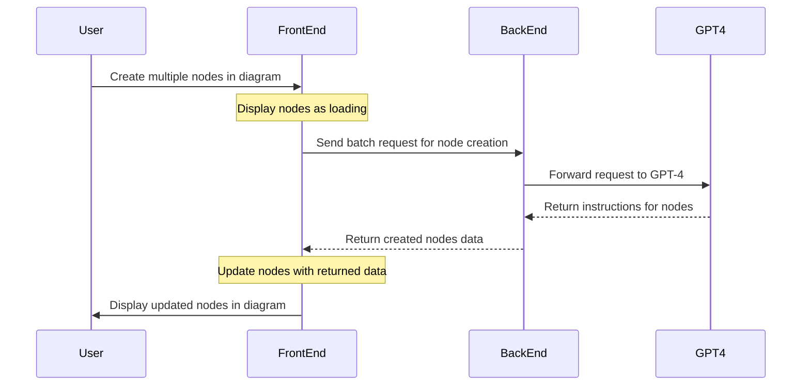

# **Optimizing User Experience and Performance in a Diagram-Driven Workflow System**

Having to make a request to the backend and GPT-4 for every node creation could slow down the user experience, particularly if there are a lot of nodes or if the network is slow. Here are several strategies that could be employed to mitigate this:

1. **Batch Processing**: Instead of making individual requests for each node, gather several nodes together and make a single batch request. This approach can significantly reduce network overhead.

2. **Lazy Loading**: You might also consider a lazy loading approach. When the user creates a node, you could immediately add it to the diagram with a loading state. In the background, make the request to the backend and GPT-4. Once you get a response, update the node with the returned information.

3. **Preloading**: In some cases, it might be beneficial to preload certain data. If you know that some nodes are likely to be created, you can make a request for these nodes in advance.

4. **Caching**: If certain requests are repeated frequently, consider implementing a caching mechanism. This could be on the client side, on the server side, or both.

5. **Web Workers**: If using a browser-based front-end, leverage web workers for background processing. This can help keep the user interface responsive even while heavy computations are going on in the background.

6. **Rate-Limiting**: Implement rate-limiting on the client-side to prevent users from overloading the server with too many requests in a short amount of time.



*In this diagram, the user interaction doesn't have to wait for the backend and GPT-4 to respond. The frontend immediately displays the nodes as loading, and only updates them with the actual data when it arrives. This can provide a more responsive experience for the user.*

###  Example

Here's an example of how you can implement batch processing and lazy loading in the system:

```javascript
// Assume we have an array of new nodes
const newNodes = [ /* ... */ ];

// Map these to promises that make requests to the server and GPT-4
const nodeCreationPromises = newNodes.map(node => createNodeOnServer(node));

// Use Promise.all to wait for all the requests to finish
Promise.all(nodeCreationPromises)
  .then(createdNodes => {
    // Now we have an array of nodes as they are on the server and GPT-4
    // We can add these to the diagram
    createdNodes.forEach(node => addNodeToDiagram(node));
  })
  .catch(error => {
    // Handle any errors here
  });
```

In this example, `createNodeOnServer` is a function that makes the necessary requests to the server and GPT-4 to create a node. It returns a promise that resolves with the created node.